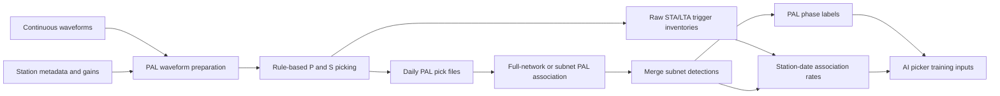

# Run PAL

Executable rule-based PAL workflows. Source modules are in `../PAL_src/`.

- `run_pal_local/`: workstation download, daily picking, and association examples.
- `run_pal_aws/`: numbered SageMaker submitters plus fixed processing-job
  entry points and monitors for picking and association.

Set `AI_PAL_ROOT` in each copied AWS submitter to the installed source package
(default `~/shared/software/AI-PAL`). The AWS section below documents
SageMaker paths and job controls. Optional legacy PAL location examples are under
`run_pal_local/optional_location/`; the centralized location workflow is
`../4_location/`.

The packaged launchers default to `CASE_CODE = "eg"`, where `eg` means "example".

## Workflow Overview



The one-click and separated launchers execute the same scientific stages. The
remaining sections describe waveform boundaries, configuration, and execution.

Both workflows publish the direct range-level products:

```text
output/<case>/phase_<start>-<end>.dat     event headers and station phases
output/<case>/catalog_<start>-<end>.dat   event headers only
```

These are the PAL results intended for location and AI-picker training. The
`picks/`, `pick_logs/`, and `association/` directories retain daily,
diagnostic, and resumable intermediate products. The one-click and split local
workflows use this same layout.
AWS association jobs publish the same two range-level files at the root of the
exported association result.

## Waveform Edges

PAL uses the same rolling raw-tail strategy as offline AI-PAL. With the default
`data_buffer_sec = 60`, the run seeds its first date from the preceding day's
final 120 s, then caches the current day's final 120 s for the next date.
The cached waveform is merged and gain-corrected but has not yet undergone PAL
detrending, tapering, or filtering. Each date therefore preprocesses 24 hours
plus 120 s while normally opening only the current daily input.

Dates are processed sequentially. Within each date, `num_workers` stations are
read and picked concurrently; all station results are collected before the
cache advances to the following date. Pick-file writes remain centralized.

The file named for nominal date `D` owns P arrivals in
`[D - data_buffer_sec, D + 1 day - data_buffer_sec)`. PAL association and daily
event filtering use the same shifted bounds. `taper_max_length_sec` must not
exceed `data_buffer_sec`. Set `data_buffer_sec = 0` to retain strict UTC-day
ownership without edge context.

## Preparation And Filtering Flags

`to_prep` and `to_filter` control different stages:

- `to_prep = True` selects a usable channel family and location, rejects
  pathological miniSEED fragmentation or overlap, merges fragments, normalizes
  the component layout, and applies station gain/unit conversion. Use this for
  raw local archives. Raw SCEDC S3 objects always require it.
- `to_prep = False` expects the local archive to contain one unambiguous trace
  per component already. Gain and unit conversion are still applied.
- `to_filter = True` applies `freq_band` before PAL picking.
- `to_filter = False` skips only the frequency filter. Alignment, finite-value
  cleanup, gap treatment, detrending, tapering, and edge exclusion remain
  active because PAL still requires a consistent signal array.

Both flags default to `True`, preserving the established raw-data workflow.

## Local Workflow

Edit the clearly marked user-settings blocks in `run_pal_local/` and run either
the one-click workflow or the two separate steps:

```bash
python 1_run_pal_pick_assoc_eg.py
# or
python 2.1_run_pal_pick_eg.py
python 2.2_run_pal_assoc_eg.py
```

Station metadata preparation now lives in `../preprocess/`. Its numbered
workflow selects channel epochs and normalizes time-varying gain intervals
before publishing the station CSV consumed here. There is no station-preparation
step in `run_pal_local/`.

Waveform readers use half-open gain intervals (`t0 <= time < t1`). If an
unprocessed station file still has a gap or lacks coverage outside its first or
last epoch, PAL and AI-PAL select the interval whose boundary is closest to the
waveform midpoint and emit one warning per station/selected epoch rather than
terminating the run.

`1_run_pal_pick_assoc_eg.py` uses one full station file for both picking and
association. The split association launcher accepts either a single `full`
station set or subnet keys matching `subnet_assoc_params` in the selected case
config. Both launchers use independent-day association for training labels.

Picking writes one `*.trigger_counts.csv` sidecar per day. Its station counts
record distinct STA/LTA trigger candidates before amplitude-ratio and related
waveform QC. Dominant frequency is not calculated or used as PAL QC. Both the
one-click and separated association workflows define:

PAL pick files use the associator-neutral row format:

```text
net_sta,tp,ts,s_amp,p_snr,amp_ratio,A12,A13
```

The rough station origin-time estimate is not persisted. It is derived from
P and S in memory when the PAL associator reads the file. Older PAL pick files
that contain `sta_ot` remain readable.

```text
association_ratio = num_associated_picks / num_picks
num_picks = pre-QC STA/LTA triggers
num_unassociated_picks = num_picks - num_associated_picks
```

This retains station-days whose triggers all fail QC with association ratio
zero. Separated association requires trigger-count and ownership sidecars
created by the current picker. Legacy buffered `.pick` files without ownership
metadata are regenerated once; legacy files remain resumable when
`data_buffer_sec = 0`.

The S picker keeps the PCA amplitude-peak anchor. S STA/LTA first searches from
the earlier of the PCA interval end and half the P-to-S-peak interval through
that peak. Its input prepends the S-LTA window and appends the S-STA window so
the characteristic function is defined over the complete target interval.
The STA/LTA peak sets the earliest S boundary; long kurtosis is calculated only
from there through the S-amplitude peak, and short kurtosis is confined by the
resulting bounds. Rolling kurtosis uses cumulative moments rather than
recalculating every overlapping window.
## AWS Workflow

The `run_pal_aws/` workflow runs PAL directly against daily miniSEED objects
in `s3://scedc-pds/continuous_waveforms`. It does not create a local waveform
archive.

The two numbered root scripts are the complete user-facing workflow:

```text
1_run_pal_pick_aws_eg.py
2_run_pal_assoc_aws_eg.py
config_aws_eg.py
input/
processing_job/
```

All case, date, I/O, retry, parallelism, and SageMaker resource settings are
grouped at the beginning of the numbered scripts. The packaged example uses
`CASE_CODE = "eg"`; copied case workflows should rename the scripts and config
consistently.

`processing_job/` contains fixed implementation files:

```text
job_common.py
monitor_pick_job.py
monitor_assoc_job.py
processing_entry_pick.py
processing_entry_assoc.py
requirements.txt
```

Users normally edit only the numbered root scripts and model parameters in
`config_aws_<CASE_CODE>.py`. The container requirements file is staged and
installed automatically. No separate root requirements file or `PAL_DIR`
environment variable is needed.

### Picking Job

In `1_run_pal_pick_aws_<CASE_CODE>.py`, set at least:

```python
AI_PAL_ROOT = Path("~/shared/software/AI-PAL").expanduser()
CASE_CODE = "eg"
station_file = "station_scedc_aws_selected_20200101_20260701_pal.csv"
time_range = "20200101-20210101"
study_year = 2020

num_workers = 16
overwrite = False
retry_failed_dates = False
instance_type = "ml.c5.9xlarge"
threads_per_worker = 2
```

`time_range` uses an exclusive end date and must match the full `study_year`.
Station intervals are half-open (`t0 <= date < t1`).

Submit and monitor from `run_pal_aws/`:

```bash
AWS_DEFAULT_REGION=us-west-2 python 1_run_pal_pick_aws_eg.py
python processing_job/monitor_pick_job.py
```

The submitter stages its runtime JSON, config, station file, and required
`PAL_src` modules. Existing output is restored when
`resume_existing_output = True`; completed daily status files are then skipped
according to the runner settings. AWS dates run sequentially, while
`num_workers` controls concurrent station processing within the current date.
This keeps one rolling preceding-day tail cache and avoids repeated neighboring
day reads.

Daily outputs are stored under the default SageMaker bucket:

```text
sagemaker/scsn-pal/results/<CASE_CODE>-pick-<YEAR>/output/<CASE_CODE>/
```

### Association Job

In `2_run_pal_assoc_aws_<CASE_CODE>.py`, set the subnet station mapping,
`time_range`, `study_year`, worker count, instance settings, and pick job
codes. Subnet keys must match `subnet_assoc_params` in the selected case config.
By default PAL derives each horizontal search range from the active stations and
`xy_margin`. Set `lat_range` and `lon_range` in the `default` or a subnet override
to fixed `[minimum, maximum]` bounds when station geometry is not representative.

The primary pick prefix must contain every target day. Set
`association_buffer_enabled = False` for independent-day training-label
association; in that mode `boundary_pick_objects` should remain empty. Buffered
association remains available for workflows that require cross-midnight event
continuity, where optional boundary objects provide the adjacent picks. Submit
only after the required picking outputs exist:

```bash
AWS_DEFAULT_REGION=us-west-2 python 2_run_pal_assoc_aws_eg.py
python processing_job/monitor_assoc_job.py
```

The submitter verifies both each daily `.pick` file and its matching
`*.trigger_counts.csv` inventory before creating the association job.

With independent-day association, every subnet reads only the target day's
picks and canonical merging uses only that day's subnet outputs. With buffered
association enabled, the expanded interval and cross-day duplicate merging are
retained.

Association output is stored under:

```text
sagemaker/scsn-pal/results/<CASE_CODE>-assoc-<YEAR>/output/<CASE_CODE>/
```

It contains `phase_<start>-<end>.dat` and `catalog_<start>-<end>.dat` as the
direct final products. Daily subnet and merged products, event-group records,
association-rate CSVs, logs, and resumable status files are kept below
`association/`. The association monitor aggregates daily pick,
associated-pick, and event counts by month.

### Source Components

The submitters stage the current implementations from `AI_PAL_ROOT/PAL_src`,
including AWS waveform access, picking and association runners, PAL models,
rolling waveform context, phase merging, and picker-ensemble metadata support.
Station files remain under
`run_pal_aws/input/`.
### Waveform rules

For each date, the pipeline selects only the band active in the PAL station
epoch. It repeats the inventory location rule: nonblank location codes first in
lexical order, followed by blank location `--`. Three components are ordered as
E/N/Z. For one-component data, that component is copied three times. For
two-component data, Z is copied three times when present; otherwise the first
horizontal component is copied three times.

Channels whose SEED instrument code is `N`, such as `HN`, are gain-corrected as
acceleration and integrated once to velocity before PAL's normal 1-20 Hz
preprocessing. Velocity channels are gain-corrected without integration.

## AWS Example Inputs

Files under `run_pal_aws/input/` provide the full SCEDC picking station list and six subnet station lists used by the example launchers. Replace them with case-specific station epochs before running another network or study period.
