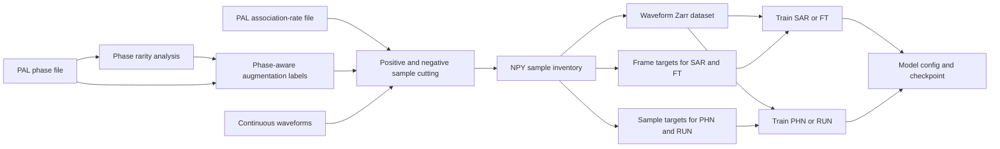

# Train Pickers

- `train_picker_local/`: integrated sample cutting and one local waveform Zarr
  dataset with frame/sample target arrays,
  continuous training via `3_train_eg.py`, and positive-window training via
  `3_train_pos_eg.py` for SAR, FT, PHN, and RUN.
- `train_picker_aws/`: SageMaker submission, container-entry, and monitoring
  workflows for sample cutting, Zarr conversion, and per-model GPU training.

Executable folders use two configuration layers:

- `config_ai_pal_eg.py` defines shared waveform preprocessing, sample
  construction, amplitude measurement, data readers, and PAL parameters.
- `config_sar_eg.py`, `config_ft_eg.py`, and the other model configs define
  only model structure, training-loop controls, and inference settings.

The `_eg` suffix marks case-specific executable examples. After renaming the
configs (for example, to `config_ai_pal_sc.py` and `config_sar_sc.py`), set the
single `CASE_CODE = "sc"` control in each local training launcher or
`CASE_CODE = "sc"` in each AWS submission or monitor script. Dataset names, prepared PAL labels, NPY/Zarr locations, checkpoint roots, and AWS run prefixes are then derived from it.
Source folders retain unsuffixed `config.py` model configs and inherit
`PAL_src/config_ai_pal.py`. Preprocessing modules use that picker-root
`config.py` directly; they do not maintain separate config copies. The distinct
`PAL_src/config_pal.py` file contains standalone defaults for rule-based PAL
runners and is not a picker model config.

`2_npy2zarr_eg.py` maps SAR/FT to integer frame targets and PHN/RUN to
Gaussian sample-resolution targets. The local workflow converts the single NPY
inventory produced by step 1 into one integrated Zarr dataset. Its time span is
therefore determined by the phase, association-rate, and waveform inputs used
for cutting; the same interface works for a one-month aftershock sequence or a
multi-year study. Waveform data and each target family are stored only once.
The AWS workflow separately uses annual Zarr stores for incremental SCEDC
maintenance and virtual concatenation during training.

Legacy SAC-to-Zarr helpers are archived under
References/backup/legacy_sac_preprocessing/; they are not staged by local or AWS
training workflows.

The packaged training workflows default to `CASE_CODE = "eg"`, where `eg` means "example".

## Workflow Overview

Rarity-aware augmentation is the default positive-sample path; the original
phase file can bypass that analysis when fixed augmentation is required.

## Local Training

Run from `train_picker_local/` after editing shared paths, `ENABLED_MODELS`, and
`gpu_idx`:

0. `python 0_analyze_phase_rarity_eg.py`
1. `python 1_cut_train-samples_eg.py`
2. `python 2_npy2zarr_eg.py`
3. `python 3_train_eg.py` for continuous-data picker training, or
   `python 3_train_pos_eg.py` for positive-window picker training.

Local training accepts either representation. For the original integrated
dataset, leave `TRAINING_YEARS = None` and point `ZARR_PATH` directly at the
Zarr store. For an annual archive, point `ZARR_PATH` at the directory containing
`2020.zarr`, `2021.zarr`, and so on, then set `TRAINING_YEARS` to the desired
chronological selection. The loader presents those stores as one virtual
concatenated dataset without copying or rebuilding the Zarr data.

Step 0 scores every station pick using the joint rarity of event magnitude/FMD,
hypocentral distance, and spatiotemporal seismicity rate. Epicentral distance
is calculated from event and station coordinates, including station elevation
in the hypocentral-distance term. It writes a PAL-compatible phase file with
tagged `num_aug`, `rarity`, `p_norm`, and distance fields, plus feature tables,
a summary, and the two diagnostic figures. Set `PHASE_FILE` in step 1 to this
rarity phase file.

`config_ai_pal_eg.py` exposes only the scientific controls: percentile
boundaries, augmentation values, maximum hypocentral distance, magnitude and
distance bin widths, and spatial/time density-bin sizes. Numerical smoothing,
floors, plotting resolution, and training-only bookkeeping are stable internal
defaults in `PAL_src/phase_rarity.py`. `positive_num_aug_mode = "phase"`
enables the new behavior.
Set it to `"fixed"`, set `num_aug` to a positive integer, and point step 1 at the original PAL phase file to retain
the global `num_aug` strategy. Its default `None` is unused in `"phase"` mode.
Validation samples are always cut once;
per-pick augmentation applies to training samples only. In rarity-aware mode,
negative sampling remains based on the original phase-pick count and each
station-date association ratio: `cut_neg_ratio = num_pos / num_unassociated`.
It is not increased or redistributed by per-pick positive augmentation.

Training phase rows may contain paired picks, P-only picks, or S-only picks.
Use `-1` for an unavailable phase, for example
`NET.STA,tp,-1` or `NET.STA,-1,ts`. The available phase anchors the waveform
window and only that phase is written into the model target. Rows with both
phase fields set to `-1` are invalid.

The first step creates shared NPY inventories. The second dispatches each
model's label converter, covering sample-segmentation and frame-label formats.
Each picker source (`picker_SAR`, `picker_FT`, `picker_PHN`, and `picker_RUN`)
also carries its own positive/negative NPY cutters and raw-shard helpers under
`preprocess/`. The combined workflow cuts the common inventory once through
SAR by default, but any picker folder can run the same cutting stage
independently using its own config and preprocessing modules.
The launchers stage `config_ai_pal_eg.py` for shared preprocessing and data
behavior, then stage one model-only `config_<model>_eg.py` per enabled picker.
Both training launchers process `ENABLED_MODELS` sequentially on one
`gpu_idx`. They derive each model source, config, and checkpoint subdirectory
from the model name while sharing one integrated Zarr dataset and checkpoint
root. Step 1 writes `NPY_ROOT`; step 2 reads that same path and writes
`ZARR_PATH`; both step 3 launchers train directly from `ZARR_PATH`. To train on
a shorter interval, provide phase and association-rate inputs for that interval
and choose matching `NPY_ROOT` and `ZARR_PATH` names. No annual subdirectories,
block manifest, or training-block selector are required locally.

Training metrics are reported every `summary_step` (100 steps by default).
Every `valid_step` (5000 steps by default), each model evaluates the complete
validation set, writes a numbered checkpoint, and updates `best.ckpt` when the
full-validation loss improves. Automatic inference prefers `best.ckpt` and
falls back to the latest numbered checkpoint for older training runs.
Each checkpoint directory also keeps `<model>_training_metrics.csv`, an
atomically updated `<model>_training_progress.png` for positive/negative
detection accuracy, and `<model>_training_diagnostics.png` for loss plus frame
accuracy (SAR/FT) or sample accuracy (PHN/RUN). Both figures show full-range and
5th-95th percentile zoom panels.

Standard training interprets `batch_size` as the number of positive windows;
negative windows are added according to the stored negative/positive ratio, up
to one negative per positive. Consequently, model computation can approach
twice the positive-only workload. The paired datasets preserve Zarr chunk
locality for both classes, and training prints the effective positive/negative
mix and chunk size at startup. `NUM_WORKERS` and `PREFETCH_FACTOR` remain
tunable in the launcher; excessive workers can reduce throughput on shared or
network storage.

`train_picker_local/input/eg_association_rates.csv` is a minimal single-file
example of the
station-date association counts written by PAL and consumed during negative-
sample preparation. Production inputs should concatenate all segmented rate
files for the same period as the phase file, retaining one CSV header.

For an older PAL run without association-rate output, edit
`pick_to_assoc_rate_eg.py` to point to the full-range pick and phase files. The
converter recognizes legacy PAL and newer AI pick formats, matches both P and S
times within the configured tolerance, and writes the consolidated training
CSV. A phase file is required because picks alone do not identify which
detections were associated.

The packaged training workflows default to `CASE_CODE = "eg"`, where `eg` means "example".

## Local Training Inputs

- `train_picker_local/input/eg_pal_hyp.pha`: one phase-label file covering the training period.
- `train_picker_local/input/eg_station.csv`: station coordinates and gains used
  to calculate epicentral/hypocentral distances in step 0.
- `train_picker_local/input/eg_association_rates.csv`: one station-date association-rate file covering
  the same period, in the format written by `PAL_src/association_runner.py`.

Concatenate segmented PAL association-rate outputs with one header. On Linux:

    awk 'FNR == 1 && NR != 1 {next} {print}' association_rate_*.csv > association_rates.csv

Plain `cat association_rate_*.csv` is also accepted by the reader, which skips
repeated header rows, but producing a single header is preferred. Set
`ASSOCIATION_RATE_FILE` in `train_picker_local/1_cut_train-samples_eg.py` to the resulting file.

Legacy runs that have a full-range pick file but no rate CSV can use
`train_picker_local/pick_to_assoc_rate_eg.py`; the matching full-range phase file is also required
to identify associated picks.

## AWS Training

The AWS workflow has four stages:

0. Prepare yearly PAL inputs and generate yearly rarity-aware phase files.
1. Cut shared positive and negative NPY samples by year.
2. Convert selected annual NPY inventories into reusable `YYYY.zarr` stores.
3. Train one GPU job for each enabled picker from a virtual concatenation of
   selected years.

The current operational step is yearly NPY cutting for completed PAL years.

### AWS Layout

The reorganized AI-PAL checkout is expected at:

    /home/sagemaker-user/shared/software/AI-PAL

The completed PAL workspace may remain at its existing location:

    /home/sagemaker-user/shared/run_pal

Set `AI_PAL_ROOT` in each copied local or AWS launcher to the installed checkout.
It defaults to `~/shared/software/AI-PAL`; unfinished legacy PAL jobs are not
affected.

### Configuration Layers

The `train_picker_aws/` folder contains two kinds of example config:

- `config_ai_pal_eg.py` defines shared waveform preprocessing, sample layout,
  augmentation, reader functions, amplitude measurement, and PAL parameters.
- `config_sar_eg.py`, `config_ft_eg.py`, `config_phn_eg.py`, and
  `config_run_eg.py` define only model structure, training-loop controls, and
  inference settings.

The `_eg` suffix marks case-specific executable files. Each staged job receives
the shared case config as `PAL_src/config_ai_pal.py` and its model case config
as model-local `config.py`.

### Prepare Annual Labels

Edit the years tuple at the top of `0.1_prepare_cut_inputs_eg.py` when needed,
then run:

    cd ~/shared/software/AI-PAL/2_train_picker/train_picker_aws
    python 0.1_prepare_cut_inputs_eg.py

For each selected year, `0.1_prepare_cut_inputs_eg.py`:

- downloads the direct yearly `phase_<time-range>.dat` product from the
  completed `<CASE_CODE>-assoc-YEAR` S3 output;
- validates the daily association-rate CSVs and combines their rows into one
  yearly CSV;
- copies the selected PAL station file from `~/shared/run_pal/input`.

For results created by an older PAL release, the script can instead concatenate
the legacy daily phase files and read rates from the former `output/assoc/`
layout.

The resulting structure under `train_picker_aws/` is:

    input/
      station_scedc_aws_selected_20200101_20260701_pal.csv
      2020/
        <CASE_CODE>_assoc_2020_pal.pha
        <CASE_CODE>_assoc_2020_association_rates.csv
      2021/
      2022/

Each yearly association-rate input contains one header and all station-date rows
for that year.

Waveforms are not downloaded here. Sample-cutting workers stream only requested
station-days from `s3://scedc-pds/continuous_waveforms/` using
`config_ai_pal_eg.py` and the shared `PAL_src/data_pipeline_training_aws.py` adapter.

After preparing the yearly files, run `0.2_analyze_phase_rarity_eg.py`. Its
`YEARS`, station path, and case code are user settings at the beginning of the
file. It creates `<case>_assoc_<year>_pal_rarity.pha` for the yearly cutting
job and stores the diagnostic CSV/JPG outputs under `output/`.

### Submit Independent Yearly Cutting Jobs

Edit `training_years` near the top of
`1_cut_train-samples_eg.py`. Keep the same `CASE_CODE` and `SAMPLE_RUN` for all
years that may be reused together. `SAMPLE_RUN` identifies the annual NPY
library; it is independent of the narrower `TRAINING_RUN` used for one Zarr
dataset and its model checkpoints.

    cd ~/shared/software/AI-PAL/2_train_picker/train_picker_aws
    AWS_DEFAULT_REGION=us-west-2 python 1_cut_train-samples_eg.py

One independent Processing Job is created per year. By default, the submitter
starts every selected year asynchronously and returns after all jobs have been
accepted by SageMaker. The Space may then be stopped; the Processing Jobs keep
running. Every output remains under its own `01_npy/<year>/` prefix. On rerun,
active jobs and years with a valid completed manifest are skipped.
If the account's concurrent Processing-instance quota is full, the remaining
years are reported as deferred. Rerun the command after an active job finishes;
the submitter skips existing work and fills the newly available slot.

Monitor every submitted year with:

    python processing_job/monitor_cut_samples_job.py

Annual artifacts are isolated at:

    s3://<default-bucket>/sagemaker/ai-pal/training/<SAMPLE_RUN>/
      01_npy/2020/
      01_npy/2021/
      01_npy/2022/
      01_npy/2023/
      01_npy/2024/
      01_npy/2025/

Each completed annual directory contains positive and negative NPY shards,
four portable shard-index files, and `cut_samples_manifest.json`.

### Cutting Controls

The main controls are at the beginning of `1_cut_train-samples_eg.py`:

- `training_years`, `CASE_CODE`, and derived `SAMPLE_RUN`
- `wait_for_each_year` (normally `False` for asynchronous submission)
- `instance_type` and `volume_size_gb`
- `num_workers` and `threads_per_worker`
- `shard_size`
- SCEDC bucket, region, access mode, and acceleration code

The Processing Job uses continuous S3 upload. A successful manifest is written
only after positive and negative cutting both finish.

### Build Zarr And Train

Set `zarr_years` in `2_npy2zarr_eg.py` to the years that still need conversion.
For an annual update this is normally just the new year. Existing stores are
protected unless `overwrite_existing_years` is explicitly enabled.

Annual NPY and Zarr outputs are reusable. `ZARR_ARCHIVE` identifies the stable
archive independently of a model experiment. For example, one archive may hold
2020-2025 while separate checkpoint products select 2020-2021, 2020-2023, or
2020-2025 by editing `training_years` in `3_train_eg.py`.

Training opens the selected annual stores as one virtual concatenated dataset.
It does not copy them into another combined Zarr, so multiple training-year
selections reuse the same annual archive without duplicating storage.

Model-to-target mapping is fixed: SAR/FT use integer frame labels, while
PHN/RUN use Gaussian sample-resolution soft labels. The enabled-model list is
reduced to the required target families, so waveform data and each target family
are written only once under each annual store:

    s3://<default-bucket>/sagemaker/ai-pal/zarr-archives/<ZARR_ARCHIVE>/
      archive_manifest.json
      2020.zarr/
      2020.manifest.json
      2021.zarr/
      2021.manifest.json

Both positive and specially sampled negative waveforms and targets are stored;
negative targets are not generated as random noise during training. The AWS
Zarr job validates all required positive/negative arrays before publishing each
annual manifest. Each GPU job validates its model-specific frame or sample
targets for every selected year before starting `train.py`, and records the
year selection plus array shapes in its manifest.

    python 2_npy2zarr_eg.py
    python processing_job/monitor_npy2zarr_job.py

After the selected annual stores and all required target arrays finish:

    python 3_train_eg.py
    python processing_job/monitor_train_jobs.py

AWS training mounts only the years listed in `training_years`. The submission
preflight sums annual artifact sizes when they are available in the manifests
and preserves `minimum_checkpoint_free_gb` plus 10 GiB for runtime files. A
selection that does not fit the GPU instance's fixed local storage is rejected
before submission; use a larger-storage instance or a narrower year selection.

`2_npy2zarr_eg.py` and `3_train_eg.py` use the configs in
`train_picker_aws/`, not the local-training examples. Edit `enabled_models` and
the model registry in each submission script when selecting a subset.

## AWS Training Inputs

Run `0.1_prepare_cut_inputs_eg.py` in SageMaker JupyterLab. For every selected year it
creates one combined PAL phase file and one combined association-rate CSV, plus
the selected SCEDC PAL station file.

The phase and association-rate files are chronological concatenations of the
canonical daily PAL outputs. The association-rate CSV contains one header and
one row per station-date record. Waveforms are streamed directly from the SCEDC
public S3 continuous-waveform archive by the Processing Job and are not copied
here.
