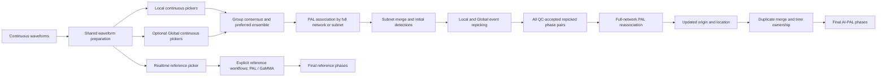

# Run AI-PAL

Global picker configs default to `trig_thres = 0.6` for SAR/FT and `0.3` for
PHN/RUN; Local thresholds remain unchanged. The SoCal AWS configs use FT width 256 / four heads / five layers
and RUN one-block stages, matching the current source architectures. Supply
matching checkpoints: changing a config does not convert older model weights.

Unified continuous inference and PAL-association entry points:

- `run_ai_pal_local/`: offline continuous picking and association examples.
- `run_ai_pal_realtime/`: restart-safe multi-picker realtime processing.
- `run_ai_pal_aws/`: resumable SCEDC S3 inference in SageMaker Processing.

Fixed positive-event and negative-event experiments belong to
`../benchmark_picker/`.

The packaged inference workflows default to `CASE_CODE = "eg"`, where `eg` means "example".
Copied case launchers also expose `AI_PAL_ROOT`, defaulting to `~/software/AI-PAL`; set it to the installed package without moving source modules into the case workspace.

## Workflow Overview



The offline `1`, `2`, and `3` launchers run picking, initial association,
and event postprocessing as separate stages. Picking loads only its selected
continuous models; repicking loads its own models in stage 3. Realtime adds persistent backfill, polling, corrected
origin-time ownership, monitoring, and optional independent reference branches.

## Local Workflow

Run these scripts in order, waiting for each stage to finish:

```bash
python 1_run_ai_pal_pick_eg.py
python 2_run_pal_assoc_eg.py
python 3_run_ai_pal_repick_reassoc_eg.py
```

These replace the former `2.1`, `2.2`, and `2.3` entry points. The combined
offline launcher has been removed. Output directories and AWS manifest IDs
keep their existing names, so completed staged results remain resumable.
Realtime is unchanged. Event repicking rereads only the required waveform
windows; its models are not loaded by the picking-only stage.

Each inference launcher defines one `CASE_CODE`. Shared/model config paths,
checkpoint roots, picks, phases, and local realtime outputs are derived from
it; the staged canonical import remains `config_ai_pal`.
`run_ai_pal_local/config_ai_pal_eg.py` supplies shared preprocessing,
sliding-window consensus, picker-ensemble, and PAL parameters. Each
`config_<model>_eg.py` supplies only model and inference settings.

Set `console_verbosity` to `"default"` for concise workflow summaries,
`"quiet"` for warnings and final outputs only, or `"debug"` for the complete
picker, association, timing, and cache log. Monitoring products retain their
full detail regardless of console verbosity.

`to_clean` and `to_filter` are independent. Legacy configs may still use
`to_prep`; `to_clean` takes precedence when both are present.
Set `to_clean = True` for raw local
files so AI-PAL performs AWS-equivalent band/location selection, fragmentation
checks, component merging, layout normalization, and gain/unit conversion. Set
it to `False` only for an already merged, unambiguous local archive. Set
`to_filter = False` to skip `freq_band` filtering; alignment, resampling,
finite-value cleanup, gap treatment, detrending, tapering, and model edge
exclusion still run. Raw AWS objects require `to_clean = True`.

Select continuous models with `picker_local_group` (local training) and
`picker_global_group` (CEED plus local-negative training). Both default to SAR/PHN.
Their picks enter one ensemble, controlled by `picker_group_min_picker_support`
(default `[0, 0, 1]`): the entries are minimum Local, Global, and total picker
support, respectively. All three conditions must pass. The default lets any one
model declare a pick; `[1, 1, 2]` requires agreement across both groups, while
`[0, 0, 2]` requires any two distinct models. Limits cannot exceed the selected
models in each group. Legacy scalar `n` means `[0, 0, n]`.
This replaces `picker_pos_neg_group_min_picker_support`.
`picker_min_cluster_size` still controls repeated-window clustering within a
single model; it is not the number of supporting models.

Migration: rename `picker_pos_neg_group` / `picker_pos_group` to
`picker_local_group` / `picker_global_group`, and similarly rename the
`repicker_*_group` settings. Deploy the updated launchers with their configs;
direct CLI calls now use `--repicker_local_json` / `--repicker_global_json`.
Detailed QC rows use `Local` and `Global`; phase provenance uses `local_only`
and `global_only`. Readers accept historical POS_NEG/POS labels. Existing
checkpoint files and output folders are not renamed automatically.

Use the newly mixed-trained CEED checkpoints for continuous inference; old
positive-only checkpoints have not gained noise discrimination automatically.
Supplied CEED checkpoints use `ceed_<model>_best.ckpt` (without `pos`).
Model configs consistently use `config_<model>_global_ceed.py`.
Runtime names Local_SAR/Local_PHN identify local models; Global_SAR_CEED/Global_PHN_CEED identify global models,
so same-architecture models have independent votes, configs, and checkpoints.

Global selection uses dataset-qualified identities:
`picker_global_group = ["SAR_CEED", "PHN_CEED"]` and
`repicker_global_group = ["SAR_CEED", "FT_CEED", "PHN_CEED", "RUN_CEED"]`.
Each `PICKERS_GLOBAL` entry declares its architecture separately, for example
`"SAR_CEED": {"model": "SAR", "config": ..., "ckpt": ..., "gpu_idx": ...}`.
To add another dataset, register a distinct identity such as `SAR_<dataset>`
with its own checkpoint/config, then select it in the relevant groups. Global
phase/QC identifiers retain that suffix (for example `Global:SAR_CEED`).
Existing config filenames and checkpoint basenames are unchanged by this step.

Postprocessing selection remains `repicker_local_group` / `repicker_global_group`.
Continuous models must be selected in the corresponding repicker group when
postprocessing is used, and loaded models are reused. Local workflows have no
reference branch; realtime reference workflows remain independently configured.
Combined, pick-only, and postprocessing launchers expose `PICKERS_LOCAL` and
`PICKERS_GLOBAL` path/device registries. AWS pick-only jobs now stage CEED configs
and checkpoints too; the separate SoCal AWS launchers follow the same rule.

Offline resume metadata records picker selection and support: old Local-only
outputs are rebuilt under the new settings. Changing the realtime selection
likewise invalidates its prior selection signature. Use a new output directory
when you want to retain old results for comparison.

Both groups use explicit `ckpt` file paths, never directory/latest selection.
Copy each model's `best.ckpt` (minimum full-validation loss) and matching config
into the inference project's `input` folder before running. For local Local
models, the defaults are `input/<case>_ckpt/sar_best.ckpt`,
`ft_best.ckpt`, `phn_best.ckpt`, and `run_best.ckpt`; set the Global paths
in `PICKERS_GLOBAL` likewise. A missing file is an error, not a fallback.
AWS uses the explicit mounted path `checkpoints/<MODEL>/best.ckpt`;
its S3 checkpoint inputs must contain that exact file. Use
`gpu_idx = -1` to run a model on CPU; nonnegative values select that CUDA
device. In the local pick-only `1_run_ai_pal_pick_eg.py`, `NUM_WORKERS = 2`
controls independent spawned date-block processes; `PREPROCESSING_WORKERS = 4`
retains concurrent station-date reading/preprocessing inside each process.
`picker_batch_size = 256` is defined in `config_ai_pal_eg.py` and inherited
by the model-specific configs; the launcher does not override it. All Local and Global device defaults
in this launcher are GPU 0; disabled picker choices are not loaded.
Daily output files are written in deterministic station order. The example
delegates reusable loading, device grouping, shared preprocessing, and ensemble
logic to `PAL_src/offline_picker_runner.py`.
The local ensemble runner reads, merges, gain-corrects, and preprocesses each
station waveform once. A `PreparedPickerStream` then caches one base tensor on
CPU and lazily transfers exactly one copy to each distinct configured device.
Every picker model is loaded once. Per-device locks serialize station inference
on the same GPU while allowing CPU I/O/preprocessing to run ahead; distinct
devices run concurrently. Models assigned to the same device run sequentially
and reuse that device's tensor. Because a buffered daily three-channel stream
can be large, increase preprocessing concurrency with attention to host RAM. Each picker
keeps standalone preprocessing as its default when called without a prepared
stream.

The pick-only launcher assigns disjoint whole-day blocks without adding extra
output days. Each process owns its models, CUDA context, device locks, and
waveform cache; same-GPU inference can overlap between processes. Only boundary
waveform context is duplicated, not daily output files. Configs are loaded
privately in each process without copying over installed source configs.
Legacy directory migration occurs before spawning. AWS retains its existing
staged execution model.

Block logs are in `output/<case>/pick_logs/pick_<start>-<end>.log`. Parent
progress reports completed/skipped days plus a 30-second heartbeat. After each
day, workers report PyTorch peak allocated/reserved GPU MiB; these exclude
CUDA context and other non-PyTorch allocations, so also inspect nvidia-smi.
An error (including CUDA OOM) fails the run and stops other workers. Restart
with fewer processes or a smaller batch after checking logs; completed outputs
remain subject to the existing resume signature checks. Changing GPU mappings
changes picker specs and may invalidate older outputs. Use a separate output
root for performance/memory comparisons.

Within each process, offline dates are processed sequentially. Before the first requested date, the
runner reads only the preceding day's final `2 * data_buffer_sec` raw tail. For
each subsequent date it reads that date once, caches its final raw tail, and
prepends the prior cached tail before preprocessing. Thus every station is
processed with a 24-hour plus `2 * data_buffer_sec` stream without repeatedly
opening both adjacent daily files. Here "raw" means merged, gain-corrected
waveform data before picker detrending, tapering, and filtering.

The file named for date `D` owns picks in the half-open interval
`[D - data_buffer_sec, D + 1 day - data_buffer_sec)`. Filtering uses a taper
capped by `taper_max_length_sec` (default 10 s), and this shifted ownership
leaves `data_buffer_sec` of waveform context on both sides. Association hours,
daily event ownership, and staged postprocessing use the same shifted bounds.
Each model first clusters raw P/S pairs across its sliding windows. Both P and S
arrivals must match within `tp_dev` and `ts_dev`, and each distinct window casts
at most one vote. `picker_min_cluster_size` controls the required number of
windows (default 2). P/S arrival times and probabilities are medians; their
population standard deviations are written as `tp_std`, `ts_std`,
`p_prob_std`, and `s_prob_std`.

After all selected continuous Local and Global models finish, their daily picks are clustered using
`picker_group_min_picker_support`. The canonical result is
written to `output/<CASE_CODE>/1.2_picks_AI-PAL-ENSEMBLE/`. Set
`save_individual_picker_outputs = False` to use temporary model branches and
retain only the ensemble; `True` preserves indexed individual branches such as
`1.1.1_picks_local_SAR/` and `1.1.2_picks_local_PHN/` as well.

Local output uses the preferred-branch subset of the realtime numbering:

```text
output/<CASE_CODE>/
|-- 1.1.<N>_picks_local_<MODEL>/   optional individual Local picks
|-- 1.2_picks_AI-PAL-ENSEMBLE/       canonical preferred picks
|-- 2.1_phase_init_AI-PAL/           initial range phase/catalog products
|-- 3.1_phase_final_AI-PAL/          final range phase/catalog; optional waveforms
`-- _internal/                     daily/hourly working products and status
```

Local workflows do not create `1.3`, `2.2`, or `3.2` because those indexes are
reserved for independent reference branches. On first use, legacy local output
directories are renamed to their indexed equivalents when the destination does
not already exist, preserving daily resume checks.

Pick rows preserve the original first six fields and append uncertainty and
provenance:

```text
net_sta,tp,ts,s_amp,p_prob,s_prob,tp_std,ts_std,p_prob_std,s_prob_std,num_support,pickers,picker_cluster_sizes
```

`s_amp` is the three-component vector displacement amplitude in metres.
Continuous picking measures it from the gain-corrected, filtered velocity
waveform over `tp - amp_win[0]` through `ts + amp_win[1]`. Event repicking
defers this measurement until PAL reassociation and both-group QC have selected
the final event candidates, so rejected repicker pairs incur no amplitude work.
Strong-motion `HN*` acceleration is converted to velocity before filtering.
PAL then recalculates event magnitude from these final amplitudes and the final
location; incomplete or invalid amplitude windows are excluded.

For individual files, `num_support` counts sliding windows. For ensemble files,
it counts distinct pickers and `pickers` contains their `|`-joined names. The
trailing `picker_cluster_sizes` field always retains each model's original
sliding-window support, for example `SAR:4|FT:3|PHN:5|RUN:2`.
Cross-picker standard deviations are calculated from one equally weighted vote
per contributing picker; within-model standard deviations are retained only in
individual outputs.

Both local picking launchers resume at daily-file granularity when
`OVERWRITE_PICKS = False`. A complete ensemble file is skipped; when individual
outputs are enabled, all selected model files must also exist. If the
individual files are complete but the ensemble is missing, only the ensemble
merge is rerun. A missing complete file or stale `.partial` file causes that
whole nominal day to be rerun, and atomic replacement prevents a partial file from
being mistaken for a completed result. Set
`OVERWRITE_PICKS = True` after changing checkpoints or picker settings.
Each new ensemble day has an adjacent `.ownership.json` sidecar. Pick files
from versions without this shifted-interval marker are rerun once rather than
being mixed with the new date convention.

Run `run_ai_pal_local/2_run_pal_assoc_eg.py` after picking. It associates only
the canonical `1.2_picks_AI-PAL-ENSEMBLE` branch. The final station rows in the phase file
retain probabilities, all four ensemble standard deviations, picker support
count, picker names, and per-picker sliding-window cluster sizes.

### Event Repicking and Reassociation

Run `3_run_ai_pal_repick_reassoc_eg.py` after association. It reads event
waveform windows again, independently of continuous picking, and loads the
selected event models once. Set `enable_post_process = True`. Final amplitudes
and magnitudes are measured for picks accepted by post-reassociation.
`PICKERS_LOCAL` contains SAR, PHN, FT, and RUN trained
on positive and negative samples; `PICKERS_GLOBAL` contains models trained on
global positives plus local negatives. Realtime can reuse continuous model instances for event repicking;
offline picking and repicking run separately. For every event, all available stations through the epicentral
distance of its farthest initial phase are evaluated. All QC-accepted P/S pairs
from Local-only, Global-only and both-group consensus enter full-network PAL
reassociation, and every qualified PAL candidate is retained. Only pairs selected
by PAL are published; there is no subsequent residual-matched supplementation.
If the repicks yield no PAL candidate,
the preliminary event is discarded. Subnet membership and a separate
post-repick station-count test are not used at this stage. Events that converge
after reassociation are
collapsed immediately in the local hourly product using the configured origin,
location, depth, and shared-phase merge criteria. Daily and range-level files
therefore concatenate already deduplicated hourly results.
Because hourly association uses buffered picks, the first subnet merge keeps
all candidate events without filtering on preliminary origin time. The
half-open hourly ownership filter `[hour_start, hour_end)` is applied only
after repicking and reassociation, using the updated origin time.

The postprocessor draws `repick_num_repeat` randomized 25 s windows once per
station-event job and shares them across both repicker groups. Windows from
multiple jobs fill `repick_batch_size`; CPU slicing uses the workflow worker
count. Models assigned to one device run sequentially against each resident
batch, while different device groups run concurrently. In every accepted job,
theoretical P is at least
`repick_phase_buffer_sec` after the window start and theoretical S is that far
before its end. The full permissible start range is
`[theoretical_S + buffer - 25, theoretical_P - buffer]`, intersected with
available waveform coverage. Jobs unable to retain the full buffer are skipped.
Initial P/S arrival values are discarded:
they neither constrain repicker output nor enter PAL reassociation. Every
vote-supported pair is retained as a PAL candidate regardless of group provenance.
Predictions are clustered across random
windows within each model and then independently within Local and Global by
both P and S. One station can contribute multiple alternative pairs to PAL.
`repick_group_min_picker_support` (default 2) is applied separately to each
group. When both groups agree, Global supplies the reported time and probability.
Within each model, the minimum repeated-window support is
`ceil(repick_num_repeat * repick_min_window_vote_ratio)`. The default ratio is
`0.2`, so 20 randomized windows require four distinct supporting windows.

Within each random window, every P-before-S combination is a candidate pair;
P and S from different windows are not paired. Pair candidates from all windows
are pooled using the same connected-component algorithm as continuous picking:
an edge requires both `abs(delta_P) < tp_dev` and `abs(delta_S) < ts_dev`.
Each window contributes at most one pair to each cluster (highest summed P/S
probability), but can contribute to multiple clusters. The same algorithm pools
all models within a group, counting distinct models instead of windows.
Theoretical arrivals do not rank or select these clusters. Transitive chains
remain allowed, so a cluster's total span can exceed either edge tolerance.

Duplicate-event merging identifies stations by `NET.STA`, including when old
and detailed station selectors coexist. The reported selector is an actual
contributing identifier: prefer the most detailed, then most frequent, with
lexical tie-breaking. Within the existing provenance priority, picker vote
ratios are combined by per-picker maximum, distinct picker support is recounted,
and quality is recalculated from that merged evidence. Duplicated records do
not add window votes. Thus merged quality may improve when different duplicate
records supply additional strong models; original QC contributions are retained.

For intervals that need adjacent-day waveform context, only the theoretical
event span plus one event-repicker window on each side is copied and merged;
the full neighboring daily stream is not duplicated for repicking.

The former near-source distance exception and minimum refined-pick ratio are
not used. Existing vote support, glitch QC, quality codes and PAL unique-station
and residual criteria remain unchanged. Reference picker branches are unchanged.
The published final postprocessed station-row schema is:

```text
net_sta,tp,ts,s_amp,quality,p_prob,s_prob,tp_std,ts_std,num_support,picker_window_vote_ratios,pick_provenance,p_snr
```

For waveform-measured final picks, the first field is `NET.STA.BAND.LOC`,
using the instrument actually selected (for example `CI.AGO.HH.10`). `BAND`
is the two-character channel family shared by the components, not `HHZ`.
A blank location retains the trailing dot (`CI.AGO.HH.`). The QC companion
uses the same identifier. Local, AWS and realtime final repicks share this
behavior; realtime reference picks are enriched during initial waveform QC.
Legacy rows or picks without an unambiguous waveform identity retain their
existing selector. Pick/initial association files may still use `NET.STA`.
The bundled locator readers accept either form and match by `NET.STA`.

`quality` is the Hypoinverse quality code. By default, both-group picks receive quality 0.
For a single-group pick, models with a randomized-window vote ratio greater than or equal to
0.5 are counted: at least three within either group give quality 0,
otherwise at least two give quality 1, one gives quality 2, and
none gives quality 3. These correspond to location weights 1.0, 0.75, 0.5,
and 0.25. `picker_window_vote_ratios` stores each model's accepted-window
count divided by `repick_num_repeat`, e.g. `SAR:0.8|SAR_CEED:0.9|PHN:0.7`.
Picker names need no group prefix or separate picker-list column. `p_snr`
packs the east, north, and vertical values as `snr_e|snr_n|snr_z`.

Tune this mapping in `config_ai_pal`:

| Parameter | Default | Meaning |
| --- | --- | --- |
| `pick_quality_both_groups_code` | 0 | Code for agreement between Local and Global; takes precedence. |
| `pick_quality_strong_vote_ratio` | 0.5 | A model is strong when its window-vote ratio is greater than or equal to this threshold. |
| `pick_quality_code0_min_pickers` | 3 | Minimum strong models within either single group for code 0; counts are not added across groups. |
| `pick_quality_code1_min_pickers` | 2 | Minimum strong models for single-group code 1. |
| `pick_quality_code2_min_pickers` | 1 | Otherwise, minimum strong models for code 2; fewer gives code 3. |

The ratio must be in [0, 1], and integer counts must satisfy
`code1_min > code2_min >= 1`; `code0_min` must be a positive integer.
These settings label picks; they do not change
picker acceptance or association criteria. The same policy is used when
duplicate picks are merged in local, AWS, and realtime processing. Missing
settings in older configs retain the defaults. Existing files are not rewritten
automatically.

The final station row retains timing standard deviations, but ensemble
probability standard deviations and per-picker details are stored in a
companion `phase_<name>.picker_qc.csv` beside each published
phase file (realtime publication windows and offline final range products).
Working/intermediate files retain the rich 19-column format so merging does
not lose details; published files have 13 columns. Shared readers accept this
format and the previous 18-column published and 19-column working formats
and reload sidecar details when available. Keep each phase/QC pair together.

The QC table contains `phase_line`, `event_ot`, `event_lat`, `event_lon`,
`station`, `tp`, `ts`, `picker_group`, `picker`, `contribution_index`,
`p_prob_median`, `s_prob_median`, `tp_std`, `ts_std`, `p_prob_std`, `s_prob_std`,
`window_vote_ratio`, `ensemble_p_prob_std`, and `ensemble_s_prob_std`.
The ensemble fields preserve the former phase-row probability spreads and
repeat on each contribution for that station pick. They are distinct from
the per-picker `p_prob_std` and `s_prob_std`. P/S probability medians and population standard
deviations describe the random-window votes in that picker's accepted cluster,
not an ensemble average or the entire prediction trace. Global and Local are
separate groups. If event merging retains multiple distinct summaries from
one picker for a station pick, they occupy separate contribution rows; their
original medians are not replaced with a median-of-medians. Group by the
event/station/picker keys when inspecting such cases.

Absent historical per-picker medians remain blank; they cannot be reconstructed
from ensemble scores or standard deviations. Only accepted, published picks
are represented, so these histograms are threshold/association-selected, not
an unbiased sample of all picker predictions. No trigger threshold changes.
The filtered waveform segments are merged
before event windows are sliced, including next-day data for the final hour.
`pick_provenance` records only `both_groups`, `local_only`, or `global_only`.
Events without enough repicker-derived pairs
for PAL reassociation are discarded; initial continuous-picker pairs are never
used as fallback output.

`p_snr_e`, `p_snr_n`, and `p_snr_z` are measured only
for final reassociated event picks, using PAL's energy STA/LTA definition on
the same filtered, gain-corrected E/N/Z velocity waveforms used for repicking.
For each component, the reported value is the maximum ratio from 0.5 s before
through 1.0 s after P, with PAL's 0.8 s forward STA and 6.0 s preceding LTA.
Missing waveform coverage is reported as `-1`.

Set `save_filtered_event_waveform` to serialize the same filtered event spans
used by the repicker as three SAC files per station after final reassociation
and merging.

`1_run_ai_pal_pick_eg.py` uses one `FULL_STATION_FILE` containing every station to
pick. It uses the rolling raw-tail cache described above and writes only P/S
pairs whose P arrival belongs to the nominal date's shifted ownership interval. Its canonical output is
`output/<CASE_CODE>/1.2_picks_AI-PAL-ENSEMBLE`.

In `2_run_pal_assoc_eg.py`, leave `SUBNET_STATION_FILES` empty to
associate that complete list once with the `full` parameters. Optional subnet
files map in order to the configured keys after `default` and `full` (`r1`,
`r2`, ...), run independently, and are merged afterward.

`3_run_ai_pal_repick_reassoc_eg.py` reads the daily initial detections from
`_internal/daily_assoc_AI-PAL/merged`. Existing runs under
`2.1.0_phase_init_AI-PAL/daily_assoc` remain supported for resuming stage 2 and
reading stage 3 inputs; no directories are moved automatically.
AI-PAL association-rate statistics use emitted AI picks as their denominator;
they do not require PAL's `*.trigger_counts.csv` inventories. Pure PAL workflows
continue to require those inventories for raw STA/LTA-trigger statistics.
After successful stage 2 completion, the user-facing
`2.1_phase_init_AI-PAL/phase_<TIME_RANGE>.dat` and
`catalog_<TIME_RANGE>.dat` contain the combined initial results. They are not
published when a daily stage fails. Failures retain full exceptions and
tracebacks in `*.failed.json` and an association-work-root `failure_report.json`;
the terminal shows only a short preview. Keep internal products for resuming
and for stage 3, which uses daily files rather than the range-level combined file.
Successful stage 3 completion publishes `3.1_phase_final_AI-PAL/phase_<TIME_RANGE>.dat`
and `catalog_<TIME_RANGE>.dat`.
New daily postprocessing results, merge records and status are kept under
`_internal/postprocess_AI-PAL`. Existing daily files/status in the final folder
remain readable for resuming. Local and AWS use the same layout; historical
folders are retained rather than automatically moved or removed. Realtime
continues to use its separate `2.1.0_phase_init_AI-PAL` numbering.
The postprocessing stage performs the same dual repicker-group
consensus, full-network PAL reassociation, candidate retention, and duplicate
merge described above. Raw data are read with ObsPy time bounds
only for event-selected stations. When a requested span crosses midnight, the
needed files from both date folders are read and merged before gain correction
and shared preprocessing. A `taper_max_length_sec` halo is included on both
sides of each requested span and removed after filtering.
Set `enable_post_process = True` before running this dedicated postprocessing
stage. The outer loop is over all initial events, while `NUM_WORKERS` controls
concurrent waveform I/O and preprocessing for stations required by the current
event. Repicker models are loaded once and reused for the full event
sequence. With `OVERWRITE = False`, completed daily phase files are resumed;
use `OVERWRITE = True` after changing repick settings or enabling a new event
waveform product.
The launcher reports range-wide initial-event progress every 1,000 completed
events, including elapsed time, throughput, ETA, and `num_done/num_all`.

The staged postprocessor writes only one final phase file per UTC day below
`3.1_phase_final_AI-PAL`; it does not retain hourly, catalog, or range-level
phase products. Set `enable_event_waveform_plot` to publish
final reassociated event plots in `event_waveform_plot`. Existing plots in the
older `event_waveform` directory are not automatically moved. Set
`save_filtered_event_waveform` independently to write one directory per final
event under `event_waveforms`, containing three filtered SAC files per station.
SAC headers `o`, `t0`, and `t1` record the event origin and final P/S arrivals;
the station-file layout is compatible with the event waveform input expected by
the cross-correlation relocation preprocessors in `4_location/2_hypodd`.

Fixed positive-event and negative-event launchers are maintained in
`../benchmark_picker/` because they are evaluation workflows rather than
continuous-data processing.
## AWS Workflow

The AWS launchers submit separate picking, association, and event
repicking/reassociation Processing Jobs, using the same shared scientific
runners as the local stages.

`PAL_src/data_pipeline_ai_aws.py` reads the public SCEDC continuous archive
directly from S3. Available channels and locations are selected per station-day
using `station_selection_order` and the configured priority lists. Complete
`NET.STA.BAND.LOC` inventories provide the matching time-dependent gains;
legacy simplified files remain supported. Each day is calibrated independently
before buffered pieces are combined. Strong-motion acceleration is integrated to velocity by the shared AWS
reader, while one- and two-component stations retain the established
three-channel expansion behavior. Initial association uses `NET.STA`; final
waveform-measured phases preserve the selected `NET.STA.BAND.LOC` identity.

Completed daily picks and hourly products are uploaded directly to the run's
S3 output prefix. Direct upload avoids SageMaker's managed-output file-count
limit. A replacement job mounts that prefix and reuses complete pick days,
which makes the workflow resumable across the five-day Processing limit.
See `run_ai_pal_aws/README_AWS.md` for submission and monitoring commands.

The `1`, `2`, and `3` AWS launchers split the workflow
into independent picking, association, and repick/reassociation jobs. They
share one S3 inference prefix and enforce completion manifests between stages.
The picking stage writes daily files with one halo day on each side of the
target range. The association stage writes daily merged initial phases. The
postprocessing stage is epoch-aware and can optionally publish filtered SAC
event waveforms for the cross-correlation relocation workflow.
## Realtime Workflow

For preferred/reference FMD, event maps, phase-count histograms, and
unmatched-event waveform inspection, see the
[catalog comparison utility](run_ai_pal_realtime/quality_control/README.md).

Edit `run_ai_pal_realtime/config_ai_pal_eg.py` for shared preprocessing,
association, merging, realtime-loop parameters, and the `picker_*_group` and
`repicker_*_group` selections. These config lists select models.
The launcher's `PICKERS_LOCAL`, `PICKERS_GLOBAL`, and `PICKER_REF`
dictionaries are available-model
registries and normally change only for paths or devices. The realtime folder contains
model configs for SAR, FT, PHN, RUN,
and SeisBench PHN-SB. Reference configs follow
`config_ref_<picker>_<case>.py`; for example,
`config_ref_phn-sb_eg.py`. Its `win_len` and `overlap_sec` are expressed in
seconds, with `win_len * samp_rate == 3000`; one `trig_thres` controls both
P and S. Paths, per-model CPU/GPU assignments, station files, and checkpoint
roots remain in `run_ai_pal_realtime/1_run_ai_pal_pick_assoc_realtime_eg.py`.
Native and postprocessing specifications share `PICKERS_LOCAL` and
`PICKERS_GLOBAL`; reference specifications are in `PICKER_REF`. All tunable
settings precede the connection-code boundary in that launcher.
Realtime source miniSEED windows are read as delivered, with no adjacent-file
waveform buffer. Their canonical `T0` and `T1` are the median start and
exclusive end times of all traces after sampling-rate cleanup and ObsPy merge.
The valid event-origin interval is
`[T0 + taper_max_length_sec, T1 - taper_max_length_sec - association_buffer_sec)`.
The association buffer is an output hard limit here, not extra waveform input.
The shared picker runtime disables PyTorch's unsupported NNPACK CPU backend
before model loading; this implementation detail is not user-configurable.
For each realtime station, component selection and gain conversion are followed
by one shared `PreparedPickerStream` preprocessing pass. Native AI-PAL pickers
reuse one cached tensor per distinct device; per-device locks allow station
preprocessing to remain parallel while inference is serialized on each device
and concurrent across different devices. The SeisBench reference adapter uses
the same filtered, edge-trimmed stream, but SeisBench `classify` retains control
of its own batching and device transfer.

`FULL_STATION_FILE` normally controls the stations prepared for all pickers.
Set it to `None` to build the picking list dynamically as the selector-deduplicated
union of `SUBNET_STATION_FILES`. In that mode at least one subnet file is required,
and the generated union is stored below the output `_internal/stations` directory.
`SUBNET_STATION_FILES` also controls PAL association. Leave it empty with a full
file to associate that list once with the `full` parameter override. When subnet
files are supplied, their names select per-subnet overrides and inherit all
unspecified values from `subnet_assoc_params["default"]`. Cross-subnet merge
parameters are retained in the shared config but are bypassed in full-only
mode.

PAL derives its horizontal grid from station coverage unless `lat_range` or
`lon_range` supplies an explicit `[minimum, maximum]` bound. Bounds in
`subnet_assoc_params["default"]` also carry into full-network reassociation and
can be replaced by the `full` override.

The preferred continuous Local and mixed-trained CEED Global models supply a joint P/S ensemble for PAL.
`reference_workflows` selects explicit picker/associator combinations; the
default is PHN-SB + PAL and PHN-SB + GaMMA. PHN-SB runs only once per segment,
and both associators reuse those picks. No Cartesian product is generated.
The reference picker list is derived from these workflows; only the required
pickers are loaded, once each. An empty `reference_workflows` disables references.

```python
self.reference_workflows = [
    {"picker": "PHN-SB", "associator": "PAL"},
    {"picker": "PHN-SB", "associator": "GaMMA"},
]
```

Install `GMMA==1.2.12` and `scikit-learn==1.6.1` in the realtime Python environment:

```bash
python -m pip install "GMMA==1.2.12" "scikit-learn==1.6.1"
```

GMMA 1.2.12 uses an API removed in scikit-learn 1.7; startup rejects incompatible
versions before loading models. Copy
`config_ref_gamma_eg.py` to the case directory and set its path in the launcher's
`ASSOCIATORS_REF["GaMMA"]["config"]` (relative to the working directory, like picker
config paths). The preferred associator is always PAL. The GaMMA config controls velocity,
geographic/depth bounds, DBSCAN, mixture fitting, timing-scatter limits, and CPU
workers. GaMMA uses the full picking station list and runs in an isolated CPU
process. `ncpu` controls its internal workers; numerical-library threads are
limited to one per worker. No additional waveform reading or picker inference
is needed. The 1.2.12 release does not expose the newer hierarchical DBSCAN
split settings, so they are deliberately absent from this config.

GaMMA receives individual P/S arrivals and their original probabilities.
Amplitude fitting is disabled because the existing displacement `s_amp` is
not the velocity amplitude expected by GaMMA. Its native events and all phase
assignments are saved beside the worker log in
`_internal/PHN-SB_GaMMA/subnet_phase/`. These CSVs precede waveform QC and OT
filtering; they are diagnostics, not the published catalog. Native GaMMA scores
are diagnostic values, not picker probabilities or location quality codes.
The paired phase format retains P and S only when both are assigned to the same
event and `ts > tp`; events must still have `min_sta` distinct NET.STA
pairs, using the same station-count convention as PAL (default 4). This single
parameter sets GaMMA's internal minimum total/P/S counts to `2 * min_sta`,
`min_sta`, and `min_sta`; complete-pair station counts are checked again after
association and waveform QC. Amplitude fitting is fixed off, not configurable.
Unpaired assignments remain in the native CSV. Associated pairs then
receive the shared amplitude/glitch QC and magnitude calculation. GaMMA's
unavailable-magnitude sentinel is never published.

With the default workflow order, reference phases are written to
`2.2.1_phase_ref_PHN-SB_PAL` and `2.2.2_phase_ref_PHN-SB_GaMMA`; final phases go
to `3.2.1_phase_final_ref_PHN-SB_PAL` and `3.2.2_phase_final_ref_PHN-SB_GaMMA`.
Both use the same corrected OT interval and advancing publication cursor.
Monitoring has a separate reference row for shared picking, association,
merging/QC, and event/pair counts. The end-to-end panel includes all workflows.

Set `enable_post_process = True` to apply the same dual-group postprocessing
used by offline event postprocessing. Repicking runs only on the
preferred `AI-PAL` ensemble branch; reference branches are
unchanged. Each source segment is first associated by subnet and merged across
subnets. Its detections are then repicked and reassociated with full-network
PAL, merged for duplicates within that same segment, and filtered to the
corrected origin-time interval. Repicking uses only one current realtime source segment; it
does not merge waveforms across source windows or retain an additional
raw-waveform copy. If the latest theoretical S arrival among the
eligible stations is later than
`source_end_time - taper_max_length_sec`, the entire event is left unchanged
rather than waiting for the next segment. No event merge is performed between
realtime source segments.

Realtime `PICKERS_LOCAL` and `PICKERS_GLOBAL` entries name one
explicit `ckpt` file per model. Packaged Cent-Cal positive-plus-negative
checkpoints are in `Pre-trained_models/Cent-Cal_ckpt/`, while CEED positive-only
checkpoints are in `Pre-trained_models/CEED/CEED_ckpt/`. Set launcher paths to those
package files or to deployment-managed copies.
Each `config_<model>_global_ceed.py` describes a CEED-trained positive picker, independent of the inference case, and is a self-contained model config rather
than a subclass of its continuous counterpart. The packaged values currently
match, but architecture, training, and inference settings can diverge for
future positive models without changing the continuous picker config.

On restart, `_internal/event_repick/event_repick_status.csv` identifies final
source segments already repicked and reassociated. Missing segments are
supplemented from their merged subnet phase files and source MiniSEED files by
running shared preprocessing only; continuous inference and initial subnet PAL
association are not repeated. Corrected segment products and any unreported
origin-time tails are generated only after this supplementation. The eight native repicker models load before
waveform ingest; continuous SAR/PHN objects are reused by the Local group
instead of loaded twice.

Realtime filtered waveforms remain available until that source segment has
completed optional repicking and reassociation. During initial picking they
use a disposable disk-backed `_internal/waveform_cache/<segment>` cache rather
than accumulating every station's full filtered stream in host RAM. After
subnet merging, only event-relevant stations are loaded; the exact shared
preprocessing result is therefore still used for repicking and waveform plots.
Cache files are removed before polling resumes. Host RSS, total cgroup memory,
and CUDA allocated/reserved memory are recorded during station progress and at
the realtime stage boundaries.

When `enable_event_waveform_plot` is enabled, short filtered waveform snapshots
are retained until the segment advances the external reporting cursor. The
first segment reports its full corrected interval. Each later overlapping
segment reports only `[previous_T1_corr, current_T1_corr)`, while its internal
phase file retains the full corrected segment interval. Only these newly
reported events are plotted to
`OUT/event_waveform_final_AI-PAL/<origin-time>.png`. Set
`enable_event_waveform_plot_ref` to zero-based indexes into
`reference_workflows` (`[0, 1]` plots both defaults); those final reference detections are
written separately under
`OUT/event_waveform_final_ref_<picker>_<associator>/<origin-time>.png`.
Snapshots earlier than the committed interval end are released immediately
after plotting. Plotting uses the window
from 5 s before origin through 10 s after the latest S pick and writes PNGs at
200 DPI. Filtered three-component station waveforms are
independently normalized, drawn in three separate gray component lanes per
station, and ordered from smaller to larger
epicentral distance. P and S markers use solid/dashed lines; retained initial,
Local+Global, Local-only, and Global-only pairs use distinct colors. The x axis is seconds relative to
the event origin time.

The single launcher performs startup backfill, multi-picker inference, parallel
subnet PAL association, subnet merging, repicking/reassociation, within-segment
deduplication, corrected-origin filtering, monotonic-tail publication,
heartbeat logging, and continuous polling.

## Station Selection and Gain Inventories

Local, AWS, and realtime workflows share `station_selection_order` (default
`"channel_first"`, optional `"location_first"`), `channel_priority`, and
`location_priority`. Realtime selects per input segment; daily workflows select
per station-day. The default complete station format retains all candidate
`NET.STA.BAND.LOC` epochs, allowing runtime fallback with the correct gains.
Local launchers use `input/example_pal_format4.sta`; case-specific AWS/realtime
filenames remain unchanged. See [station formats](../STATION_FORMATS.md).
