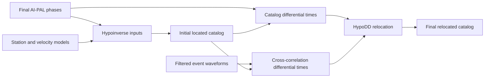

# Location

Post-association workflows for final AI-PAL event location, centralized from
the former SAR work directory:

- `1_hypoinverse/`
- `2_hypodd/`

The location stage is part of the complete AI-PAL detection workflow. Users may
select the location method appropriate for their catalog; the legacy PAL-local
location example under `../1_run_pal/` is optional.

## Workflow Overview

Hypoinverse supplies the initial catalog. HypoDD may then use catalog-time,
cross-correlation, or combined differential-time constraints.

These workflows will be generalized further in a later location-focused update.
