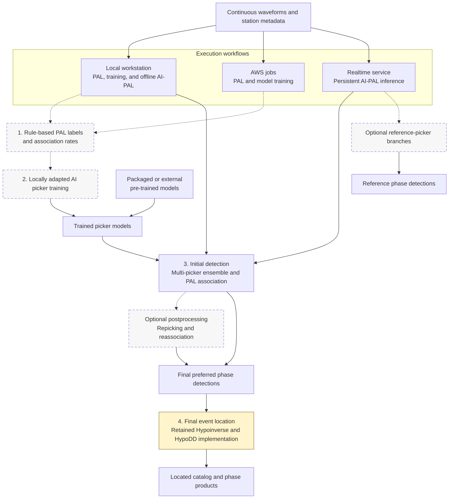

# AI-PAL

AI-PAL is a self-supervised earthquake detection framework built around one
central idea: use the rule-based Phase picking, Association, and Location (PAL)
algorithm to generate locally adapted phase labels and training samples from
continuous seismic data, then train AI phase pickers for that region and
associate their picks with PAL.

Version 7.x is a major update from v6.x. It reorganizes the package into shared
source, model, and executable-workflow layers; extends continuous inference to
multi-picker ensembles; and adds event-level repicking and reassociation as a
new postprocessing stage. The established initial detection sequence of AI
phase picking followed by PAL association is retained. The reorganized package
supports local workstation, AWS, and persistent realtime workflows for model
training and continuous-data processing, followed by final event location.

## 1. Overview

AI-PAL provides three execution workflows around one shared scientific chain:



Dashed boxes are optional for a particular run. PAL label generation and local
training may be skipped when suitable pre-trained models already exist, but
they remain the central mechanism for adapting AI-PAL to a new region.
Postprocessing and independent reference-picker branches are also configurable.

Final event location is not optional for a completed AI-PAL catalog. Version
7.x retains the existing `4_location/` Hypoinverse and HypoDD packages. This
module is expected to receive implementation and interface updates in a future
release, without changing its established theoretical basis.

## 2. Repository Structure

| Path | Purpose |
| --- | --- |
| `PAL_src/` | Shared waveform pipeline, PAL algorithms, configuration, orchestration, merging, and postprocessing. |
| `preprocess/` | Shared waveform-download and preprocessing examples. |
| `picker_SAR/`, `picker_FT/`, `picker_PHN/`, `picker_RUN/` | Peer AI picker packages. Each includes preprocessing and sample construction, model and dataset definitions, training, and continuous/positive inference. |
| `1_run_pal/` | Executable rule-based PAL workflows for label generation and association. |
| `2_train_picker/` | Shared training-data preparation and picker-training workflows. |
| `3_run_ai_pal/` | Multi-picker continuous inference, association, and postprocessing workflows. |
| `4_location/` | Hypoinverse and HypoDD workflows for final AI-PAL event location. |
| `Pre-trained_models/` | Packaged model checkpoints and their matching model configs. |
| `benchmark_picker/` | Picker benchmarking and positive-picker research workflows. |
| `References/` | External implementations and preserved migration material. |

The four `picker_*` packages have equal status. Any one can be trained and run
as an independent picker, or combined with the others in an AI-PAL ensemble.
Their model architectures and target formats differ, but they expose the same
training and inference role to the workflow.

## 3. Installation And Configuration

### 3.1 Source Location

The example launchers assume that the package is installed at:

```text
~/software/AI-PAL
```

Executable workflow folders may be copied into a separate case workspace. Set
`AI_PAL_ROOT` at the beginning of each copied launcher when the package is
installed elsewhere. Source paths are not inferred from the executable's own
location.

### 3.2 Python Environment

The main runtime requires:

- NumPy and SciPy
- ObsPy
- PyTorch
- Zarr and compressor support for training
- Matplotlib for diagnostics
- TensorBoardX for training logs
- SeisBench for the packaged reference PhaseNet branch

Use a PyTorch build compatible with the deployment CUDA runtime when GPU
inference or training is required. Individual models can run on CPU by setting
their `gpu_idx` to `-1`.

### 3.3 Case Configuration

Packaged examples use `CASE_CODE = "eg"`, where `eg` means "example". A copied
case may rename its configs, for example from `config_ai_pal_eg.py` to
`config_ai_pal_sc.py`, and then set `CASE_CODE = "sc"` in the launcher.

Configuration is divided into two layers:

- `config_ai_pal_<case>.py` defines shared waveform processing, sample layout,
  picker groups, association, merging, and postprocessing.
- `config_<model>_<case>.py` defines one model's architecture, training loop,
  and inference thresholds.

The standalone rule-based PAL workflow uses `PAL_src/config_pal.py`.

## 4. End-To-End Workflow

### 4.1 Generate PAL Labels

Use `1_run_pal/` to run the rule-based picker and associator. PAL outputs phase
files and station-date association rates used to build self-supervised AI
training data.

See [1_run_pal/README.md](1_run_pal/README.md) for station metadata, gain
normalization, waveform boundaries, and execution instructions.

### 4.2 Train AI Pickers

Use `2_train_picker/` to:

1. Analyze phase rarity and assign positive-sample augmentation.
2. Cut positive and negative training samples.
3. Build the shared waveform Zarr and frame/sample target arrays.
4. Train SAR, FT, PHN, and RUN independently.

Each picker package also contains its own `preprocess/` implementation and can
construct its training inputs independently. The combined training workflow
avoids duplicating shared waveform storage when multiple models are trained on
the same data.

See [2_train_picker/README.md](2_train_picker/README.md) for data contracts,
label formats, resumable Zarr creation, and training commands.

### 4.3 Run AI-PAL

Use `3_run_ai_pal/` for continuous waveform inference. The preferred picker
groups produce a canonical `picks_ENSEMBLE` branch that PAL associates. The
workflow can then repick detected events with POS_NEG and positive-only model
groups, reassociate reliable phase pairs, supplement compatible single-group
picks, and merge duplicate detections.

The package provides:

- A one-command pick, associate, repick, and reassociate workflow.
- Separate picking, association, and postprocessing stages.
- A persistent realtime workflow with backfill, polling, health monitoring,
  corrected origin-time ownership, and independent reference-picker branches.

See [3_run_ai_pal/README.md](3_run_ai_pal/README.md) for picker selection,
checkpoint/device assignment, phase schemas, output directories, restart
behavior, realtime processing, and performance monitoring.

### 4.4 Locate Events

Event location is part of the complete AI-PAL detection workflow. Use
`4_location/` to produce final event locations with Hypoinverse and/or HypoDD.
The legacy PAL-local location example under `1_run_pal/` is optional; the
location stage for final AI detections is not.

See [4_location/README.md](4_location/README.md) for the currently packaged
location workflows.

## 5. Core Data Contracts

### 5.1 Waveforms And Stations

Station selectors use:

```text
NET.STA.CH_PREFIX
```

For example:

```text
CI.WWB.HH
```

Station files provide coordinates, elevation, and PAL-format gain intervals.
Waveforms are converted from counts to velocity in `m/s`; `HN*` acceleration
channels are first converted to `m/s^2` and then integrated. Split traces are
merged before channel selection. One-, two-, and higher-component inputs are
normalized to the three-component model contract.

Waveforms shared by multiple pickers are read, gain-corrected, filtered, and
prepared once. Native models reuse one tensor per assigned device.

### 5.2 Picker Groups

AI-PAL distinguishes:

- `picker_pos_neg_group`: models trained with positive and negative windows.
- `picker_pos_group`: positive-only models optionally used during continuous
  picking.
- `repicker_pos_neg_group` and `repicker_pos_group`: models used after an
  initial detection.
- `picker_ref_group`: independent reference branches used for comparison.

Each model first consolidates repeated detections across sliding windows.
Configured group support is then applied before accepted picks are merged into
the preferred ensemble. Reference picker results remain separate.

### 5.3 Association And Postprocessing

PAL can associate one full network or several station subnets with independent
parameters and travel-time tables. Subnet detections are merged with connected
duplicate groups, including events detected by more than two subnets.

Postprocessing uses repicker phase pairs detected by both POS_NEG and positive
groups as PAL reassociation anchors. Compatible POS_NEG-only or positive-only
pairs can be supplemented after the event origin and location are updated.
Final phase rows retain picker support, uncertainty, provenance, displacement
amplitude, and per-component P-wave energy SNR for downstream quality control
and location weighting.

### 5.4 Realtime Event Ownership

For each realtime miniSEED segment, `T0` and `T1` are the median trace start and
exclusive end times after sampling-rate cleanup and trace merging. The valid
event-origin interval is:

```text
[T0 + taper_max_length_sec,
 T1 - taper_max_length_sec - association_buffer_sec)
```

Repicking, reassociation, and within-segment duplicate merging occur before
this filter. The first segment publishes its complete valid interval; later
segments publish only the unreported tail through their corrected end time.
Realtime events are not merged across source segments.

## 6. Pre-Trained Models

Packaged checkpoints are stored separately from executable case folders:

```text
Pre-trained_models/
|-- Cent-Cal_ckpt/   # positive-plus-negative SAR, FT, PHN, and RUN
`-- CEED_ckpt/       # positive-only SAR, FT, PHN, and RUN
```

Each directory also contains the matching example model configs. Point copied
workflow launchers to these files or to deployment-managed model copies. Keep
checkpoint and config versions together when publishing or deploying a model.

## 7. Outputs And Quality Control

The realtime workflow separates preferred, reference, initial, postprocessed,
and externally finalized products. Its principal branches are:

```text
1.1.*_picks_*/                 individual preferred picker outputs
1.2_picks_AI-PAL-ENSEMBLE/     canonical preferred picks
1.3.*_picks_ref_*/             independent reference picks
2.1.0_phase_init_AI-PAL/       initial preferred detections
2.1_phase_AI-PAL/              postprocessed preferred detections
2.2.*_phase_ref_*/             direct reference detections
3.1_phase_final_AI-PAL/        finalized preferred phases
3.2.*_phase_final_ref_*/       finalized reference phases
monitoring/                    timing, memory, heartbeat, and health products
```

Detailed row schemas and restart-completion rules are documented in
[3_run_ai_pal/README.md](3_run_ai_pal/README.md).

## 8. Production Handoff

Before promoting a release to an unattended production service:

1. Pin the Python, CUDA, and model environment.
2. Version station metadata, gain intervals, configs, and checkpoints.
3. Define atomic miniSEED input readiness and single-process ownership.
4. Run under a service manager with restart policy and log rotation.
5. Monitor input lag, successful segments, bad files, memory, GPU use,
   throughput, and disk space.
6. Define retention for waveforms, picks, phases, merge logs, and monitoring
   products.
7. Validate scientific performance and output compatibility on a frozen test
   interval before tagging a release.

## 9. Tutorials

- 2021/10 Chinese online training: [KouShare](https://www.koushare.com/lives/room/549779)
- 2022/08 Chinese online training: [KouShare](https://www.koushare.com/video/videodetail/31656)

## 10. References

- **Zhou, Y.**, H. Ding, A. Ghosh, and Z. Ge (2025). AI-PAL:
  Self-Supervised AI Phase Picking via Rule-Based Algorithm for Generalized
  Earthquake Detection. *Journal of Geophysical Research: Solid Earth*.
  [doi:10.1029/2025JB031294](https://doi.org/10.1029/2025JB031294)
- **Zhou, Y.**, A. Ghosh, L. Fang, H. Yue, S. Zhou, and Y. Su (2021). A
  High-Resolution Seismic Catalog for the 2021 MS 6.4/Mw 6.1 Yangbi Earthquake
  Sequence, Yunnan, China. *Earthquake Science*, 34(5), 390-398.
  [doi:10.29382/eqs-2021-0031](https://doi.org/10.29382/eqs-2021-0031)
- **Zhou, Y.**, H. Yue, L. Fang, S. Zhou, L. Zhao, and A. Ghosh (2021). An
  Earthquake Detection and Location Architecture for Continuous Seismograms:
  Phase Picking, Association, Location, and Matched Filter (PALM).
  *Seismological Research Letters*, 93(1), 413-425.
  [doi:10.1785/0220210111](https://doi.org/10.1785/0220210111)
- **Zhou, Y.**, H. Yue, Q. Kong, and S. Zhou (2019). Hybrid Event Detection and
  Phase-Picking Algorithm Using Convolutional and Recurrent Neural Networks.
  *Seismological Research Letters*, 90(3), 1079-1087.
  [doi:10.1785/0220180319](https://doi.org/10.1785/0220180319)
