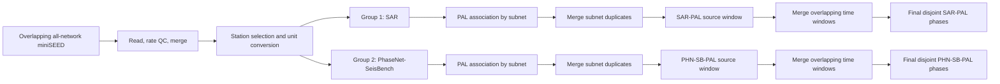

# AI-PAL

AI-PAL localizes AI phase pickers with the rule-based PAL association and
location workflow for generalized earthquake detection. This repository
contains the published offline workflow and a pseudo-realtime extension for
continuous SCSN-style miniSEED delivery.

The realtime implementation is currently a research-to-engineering system. It
supports restart-safe backfill, multiple picker branches, parallel subnet PAL
association, duplicate-event merging, and half-window-delayed final phase
products. See [Production Handoff](#production-handoff) before deploying it as
an unattended service.

## Repository Structure

| Path | Purpose |
| --- | --- |
| `1_PAL/` | Original rule-based picking, association, and location code. |
| `2_SAR/` | SAR model, offline training/inference, and the current realtime pipeline. |
| `2_SAR/preprocess/` | Training-sample cutting and NPY-to-Zarr conversion. |
| `2_SAR/run_sar/` | Example work directory, configs, launchers, and audits. |
| `3_Repicker/` | Repicking research code. |
| `4_PHN_pos/`, `4_RUN_pos/`, `4_SAR_pos/` | Experimental picker workflows. |
| `Pos_picker_benchmark/` | Picker comparison and evaluation material. |
| `Cent_Cal_config/` | Central California configuration material. |
| `References/` | External/reference implementations used in development. |

## Realtime Architecture



### Waveform Preparation

Each input file is one overlapping time segment containing all stations and
channels as separate miniSEED traces, for example:

```text
scsn_20260717T010001Z.ms
```

The filename timestamp is treated as the segment endpoint. For each file the
pipeline:

1. Reads all traces and drops conflicting duplicate traces with bad sampling
   rates.
2. Merges split traces with `Stream.merge(fill_value=0)`.
3. Selects stations using `NET.STA.CH_PREFIX`.
4. Applies the configured location-code priority, favoring borehole locations.
5. Orders three components; a one-component station is copied three times.
6. Converts counts using PAL-format gain/sensitivity values. `HN*`
   acceleration is integrated to velocity.
7. Gives each picker an independent copy of the prepared station stream.

### Station Files

One or more subnet station files are supplied by the launcher. Their first
fields are:

```text
NET.STA.CH_PREFIX,latitude,longitude,elevation,...gain fields...
```

Example selector:

```text
CI.WWB.HH
```

Use one file for a single network or multiple files for independent subnet
association. Each subnet has its own PAL parameters and time table. Time tables
are built in parallel once at process startup.

Gain fields must convert counts to the units used by PAL magnitude measurement:
velocity in `m/s` for ordinary channels and acceleration in `m/s^2` for
`HN*` channels before integration.

### Picker Groups

Picker groups are configured in `2_SAR/run_sar/config_realtime_eg.py`:

```python
self.picker_groups = [["SAR"], ["PHN-SB"]]
self.association_methods = ["PAL"]
```

- Group 1 is the preferred AI-PAL family and currently contains SAR.
- Group 2 contains reference pickers and currently contains the original
  PhaseNet weights loaded through SeisBench.
- `pg1_gpu_idx` and `pg2_gpu_idx` assign one GPU to each group.
- Each picker currently runs independently through PAL. Ensemble logic is
  planned but not implemented.

Shared picker parameters are `picker_batch_size`, `tp_dev`, `ts_dev`, and
`amp_win`. SeisBench averages overlapping PhaseNet probability curves. P and S
detections are then independently consolidated using `tp_dev` and `ts_dev`,
retaining the highest-probability detection. Every forward P/S combination
within PhaseNet's native window duration is sent to PAL.

### Association And Merging

For each picker branch:

1. PAL runs independently for every station subnet.
2. Subnet phase files are merged into one phase file for the source window.
3. Events are linked as duplicates by configured origin/location limits or by
   common phase evidence: the configured number of stations with matching P
   and S picks inside the phase-time tolerance.
4. Entire connected groups are merged, including detections from more than two
   subnets.
5. Adjacent overlapping source windows are merged again. Only events in their
   shared time interval are published, producing disjoint final segments with
   a half-window reporting delay.

Realtime output is phase-only. The current multi-picker workflow does not
publish PAL catalog files.

## Offline SAR Training

Realtime operation performs inference only. Train and select SAR checkpoints
offline from historical PAL labels and continuous data.

Copy `2_SAR/run_sar/` to a work directory, edit the paths and parameters at
the beginning of each example, then run:

```bash
python 1_cut_train-samples_eg.py
python 2_npy2zarr_eg.py
python 3_train_eg.py
```

These steps cut positive/negative NPY shards, build a chunked Zarr dataset, and
train SAR. The older SAC-to-Zarr path remains for compatibility; NPY shards are
the current path for large datasets.

## Realtime Usage

### Dependencies

Create a Python environment containing at least:

- NumPy and SciPy
- ObsPy
- PyTorch with the deployment CUDA runtime
- SeisBench (`0.12.2` is the currently tested integration)
- Zarr and compressor support for training
- Matplotlib for timing plots
- TensorBoardX for SAR training logs

Verify the environment:

```bash
python -c "import torch; print(torch.__version__, torch.cuda.is_available())"
python -c "import seisbench; print(seisbench.__version__)"
```

The first PhaseNet-SeisBench launch may download and cache the `original`
pretrained weights.

### Configure Parameters

Edit `config_realtime_eg.py` in the work directory. It contains parameters,
not deployment paths:

- SAR architecture and picker thresholds
- Picker groups and PhaseNet thresholds/overlap
- Per-subnet PAL association parameters
- Cross-subnet and cross-window merge parameters
- Polling limits
- Location-code priority

For continuous operation:

```python
self.poll_interval_sec = 10
self.max_files = 0
self.max_runtime_sec = 0
```

Nonzero limits intentionally stop the process after the configured number of
attempted files or elapsed runtime.

### Configure Paths And GPUs

Copy or rename `4_pick_assoc_realtime_eg.py`, then edit its top-level controls:

```python
sar_dir = "/path/to/AI-PAL/2_SAR"
subnet_sta_files = ["input/station_realtime_scsn_complete_r1.csv", ...]
in_dir = "/app/aqms/ai_pal/IN"
out_root = "/app/aqms/ai_pal/OUT"

pg1_gpu_idx = 0
pg2_gpu_idx = 1
num_workers = 5
ckpt_dir = "input/Cent-Cal_ckpt"
ckpt_idx = -1
```

`ckpt_idx = -1` selects the newest SAR checkpoint in `ckpt_dir`.

### Start

Run the launcher from the work directory:

```bash
python -u 4_pick_assoc_realtime_scsn.py
```

The launcher copies the realtime config into `2_SAR/config.py`, loads both
models, builds subnet PAL time tables in parallel, audits existing output,
backfills incomplete input files, and then polls for new miniSEED files.

PAL time-table construction can make startup take several minutes. PhaseNet
weights are normally loaded from the SeisBench cache after the first run.

### Restart And Completion

The process never moves or deletes input miniSEED files.

`done_record_list.txt` is an audit record; actual outputs are authoritative. An
input is complete only when every enabled picker branch has both its `.pick`
file and its merged PAL phase file.

Consequently:

- Old done records do not suppress files after adding a picker branch.
- Partial outputs are regenerated on restart.
- Complete outputs without a done record are recognized and skipped.
- Existing source-window phases rebuild missing final merged intervals before
  realtime polling.
- Files in `bad_record_list.csv` remain skipped until reviewed or removed.

After backfill, the process scans `IN` every `poll_interval_sec` and prints an
idle status every 60 seconds.

## Output Layout

For `out_root=/app/aqms/ai_pal/OUT`:

```text
OUT/
|-- 1.1_picks_SAR/
|-- 1.2_picks_PhaseNet-SeisBench/
|-- 2.1_phase_SAR_PAL/
|-- 2.2_phase_PHN-SB_PAL/
|-- 3.1_phase_final_SAR_PAL/
|-- 3.2_phase_final_PHN-SB_PAL/
|-- _internal/
|   |-- SAR_PAL/
|   `-- PHN-SB_PAL/
|-- timing/
|-- done_record_list.txt
`-- bad_record_list.csv
```

- `1.*`: P/S pairs, displacement amplitude, and P/S probabilities.
- `2.*`: subnet-merged phase files for original waveform windows.
- `3.*`: final disjoint phases after overlap-window merging.
- `_internal/`: subnet phases, merge logs, and final-merge state.
- `timing/`: initialization, per-segment and aggregate CSVs, plus PNG plots.

Phase rows contain station selector, P time, S time, displacement amplitude, and
P/S probabilities. Event headers use compact fixed precision for origin time,
latitude, longitude, depth, and magnitude.

## Audit Utilities

Standalone utilities in `2_SAR/run_sar/` keep user-editable paths and
thresholds near the top:

- `check_duplicate_events.py`: reports duplicate pairs and connected groups.
- `check_phase_time_ranges.py`: checks origin times against source windows.
- `check_mseed_time_ranges.py`: checks trace coverage and unreadable files.

Set their inputs to the desired `2.*` or `3.*` branch before running them.

## Timing And Monitoring

Startup reports GPU assignments, model load times, subnet time-table times,
input count, validated current outputs, and backfill count. Every completed
segment prints and records data read, merge, station preparation, picker,
association, event merge, and final-window merge timing.

## Production Handoff

Before promoting a GitHub tag to production, address these items explicitly:

1. Pin and export the complete Python/CUDA environment.
2. Replace absolute example paths with deployment-managed configuration.
3. Define atomic input readiness. The poller currently assumes a visible
   miniSEED file has finished being written.
4. Enforce one active process per input/output root or add claim/locking.
5. Use a service manager with restart policy, captured logs, rotation, and
   health checks.
6. Monitor input lag, last successful segment, bad-file count, GPU memory,
   throughput, association time, and disk space.
7. Define retention for waveforms, picks, internal subnet files, merge logs, and
   timing products.
8. Version station metadata, gains, checkpoints, picker config, and subnet
   association parameters with each release.
9. Add integration fixtures for corrupt miniSEED, split/rate-conflict traces,
   one-component stations, strong motion, location codes, restart/backfill, and
   overlapping-window duplicates.
10. Validate scientific metrics and output compatibility on a frozen benchmark
    interval before promoting a tag.

### Current Limitations

- Realtime pickers are currently `SAR` and `PHN-SB`.
- PAL is the only realtime associator.
- Two picker groups and two explicit GPU controls are supported.
- Preferred-picker ensemble logic is not yet implemented.
- Input readiness and single-process ownership are operational contracts.
- PAL time tables are rebuilt at every process start.

## Tutorials

- 2021/10 Chinese online training: [KouShare](https://www.koushare.com/lives/room/549779)
- 2022/08 Chinese online training: [KouShare](https://www.koushare.com/video/videodetail/31656)

## References

- **Zhou, Y.**, H. Ding, A. Ghosh, and Z. Ge (2025). AI-PAL:
  Self-Supervised AI Phase Picking via Rule-Based Algorithm for Generalized
  Earthquake Detection. *Journal of Geophysical Research: Solid Earth*.
  [doi:10.1029/2025JB031294](https://doi.org/10.1029/2025JB031294)
- **Zhou, Y.**, A. Ghosh, L. Fang, H. Yue, S. Zhou, and Y. Su (2021). A
  High-Resolution Seismic Catalog for the 2021 MS 6.4/Mw 6.1 Yangbi Earthquake
  Sequence, Yunnan, China. *Earthquake Science*, 34(5), 390-398.
  [doi:10.29382/eqs-2021-0031](https://doi.org/10.29382/eqs-2021-0031)
- **Zhou, Y.**, H. Yue, L. Fang, S. Zhou, L. Zhao, and A. Ghosh (2021). An
  Earthquake Detection and Location Architecture for Continuous Seismograms:
  Phase Picking, Association, Location, and Matched Filter (PALM).
  *Seismological Research Letters*, 93(1), 413-425.
  [doi:10.1785/0220210111](https://doi.org/10.1785/0220210111)
- **Zhou, Y.**, H. Yue, Q. Kong, and S. Zhou (2019). Hybrid Event Detection and
  Phase-Picking Algorithm Using Convolutional and Recurrent Neural Networks.
  *Seismological Research Letters*, 90(3), 1079-1087.
  [doi:10.1785/0220180319](https://doi.org/10.1785/0220180319)
