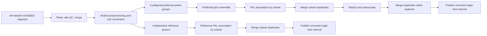

# AI-PAL

AI-PAL localizes AI phase pickers with the rule-based PAL association and
location workflow for generalized earthquake detection. This repository
contains the published offline workflow and a pseudo-realtime extension for
continuous SCSN-style miniSEED delivery.

The realtime implementation is currently a research-to-engineering system. It
supports restart-safe backfill, multiple picker branches, parallel subnet PAL
association, within-segment duplicate-event merging, and corrected-origin-time
final phase products. See [Production Handoff](#production-handoff) before deploying it as
an unattended service.

## Repository Structure

| Path | Purpose |
| --- | --- |
| `PAL_src/` | Shared AI-PAL configuration/data pipeline, PAL algorithms, offline/realtime orchestration, and picker adapters. |
| `preprocess/` | Shared waveform-download and preprocessing examples. |
| `picker_SAR/` | SAR model, datasets, training loops, and continuous/positive inference. |
| `picker_FT/`, `picker_PHN/`, `picker_RUN/` | Model-specific structure, training, and inference. |
| `1_run_pal/` | Indexed local and AWS rule-based PAL executable workflows. |
| `2_train_picker/` | Shared dataset preparation and multi-model training workflows. |
| `3_run_ai_pal/` | Local, AWS, and realtime multi-picker AI-PAL workflows. |
| `4_location/` | Optional Hypoinverse and HypoDD location workflows. |
| `benchmark_picker/` | Picker comparison and evaluation material. |
| `Pre-trained_models/` | Cent-Cal positive-plus-negative and CEED positive-only checkpoints with matching model configs. |
| `References/` | External implementations and preserved migration material. |

The package default case code is `eg` ("example"). All case-derived config and artifact paths use `eg` until a copied workflow explicitly selects another code.

The default installed source location is `~/software/AI-PAL`. Executable folders
may be copied into an independent case workspace such as `~/SoCal`; each
launcher therefore exposes `AI_PAL_ROOT` in its user-settings block instead of
inferring source location from `__file__`. Change that one path when AI-PAL is
installed elsewhere.

`PAL_src/config_ai_pal.py` is the installed shared workflow configuration used
by picker model configs. `PAL_src/config_pal.py` is the standalone default for
the rule-based PAL command-line runners. Executable workflows stage their
case-specific `config_ai_pal_eg.py` as `PAL_src/config_ai_pal.py` before running.

## Realtime Architecture



### Waveform Preparation

Each input file is one overlapping time segment containing all stations and
channels as separate miniSEED traces, for example:

```text
scsn_20260717T010001Z.ms
```

The filename timestamp identifies the segment, but does not define its data
bounds. After sampling-rate cleanup and trace merging, `T0` and `T1` are the
median trace start and exclusive end times. For each file the pipeline:

1. Reads all traces and drops conflicting duplicate traces with bad sampling
   rates.
2. Merges split traces with `Stream.merge(fill_value=0)`.
3. Selects stations using `NET.STA.CH_PREFIX`.
4. Applies the configured location-code priority, favoring borehole locations.
5. Orders three components; a one-component station is copied three times.
6. Converts counts using PAL-format gain/sensitivity values. `HN*`
   acceleration is integrated to velocity.
7. Reuses the prepared waveform and caches one tensor copy per configured device.

### Station Files

Offline and realtime picking normally use one complete station file containing
every station selector to process. In the combined local and realtime
workflows, `FULL_STATION_FILE = None` instead derives picker coverage from the
selector-deduplicated union of `SUBNET_STATION_FILES`. Station-file rows begin
with:

```text
NET.STA.CH_PREFIX,latitude,longitude,elevation,...gain fields...
```

Example selector:

```text
CI.WWB.HH
```

For offline local association, an empty optional subnet list uses the complete
station file under `full`. Optional files map in order to `r1`, `r2`, and later
subnet entries. Realtime follows the same separation: subnet files restrict
only PAL association and do not restrict picking. With no subnet files, PAL associates the complete station
file once under the `full` config key. With subnet files, each named subnet
inherits association values from `subnet_assoc_params["default"]` and may
override selected values in its own entry.

Each association network has its own PAL parameters and time table. Time tables
are built in parallel once at process startup. Realtime imports the shared
`PAL_src/associator_pal.py` implementation directly: travel times are vectorized
over the full longitude/latitude/depth grid for each station, and each subnet
worker retains its associator and time table for the lifetime of the process.

Realtime station waveforms are also preprocessed once into a
`PreparedPickerStream`. Native models reuse one tensor per device, while the
SeisBench reference branch consumes the shared filtered stream through its own
`classify` batching interface.
Gain fields must convert counts to the units used by PAL magnitude measurement:
velocity in `m/s` for ordinary channels and acceleration in `m/s^2` for
`HN*` channels before integration.

### Picker Groups

Local and realtime preferred picking use the same two-group strategy:

```python
self.picker_pos_neg_group = ["SAR", "PHN"]
self.picker_pos_group = []
self.picker_pos_neg_group_min_picker_support = 1
self.picker_pos_group_min_picker_support = 2
self.repicker_pos_neg_group = ["SAR", "FT", "PHN", "RUN"]
self.repicker_pos_group = ["SAR", "FT", "PHN", "RUN"]
```

Realtime additionally supports independent reference pickers:

```python
self.picker_pos_neg_group = ["SAR", "PHN"]
self.picker_pos_group = []
self.picker_ref_group = ["PHN-SB"]
self.picker_pos_neg_group_min_picker_support = 1
self.picker_pos_group_min_picker_support = 2
self.repicker_pos_neg_group = ["SAR", "FT", "PHN", "RUN"]
self.repicker_pos_group = ["SAR", "FT", "PHN", "RUN"]
```

- Each preferred group first applies its own minimum picker support. Accepted
  POS_NEG and POS group picks are then merged into one AI-PAL pick file.
- `picker_ref_group` selects independent reference picking and PAL association
  branches; reference picks are not merged into AI-PAL.
- Continuous group models must also appear in the matching `repicker_*_group`;
  the loaded models are reused during event repicking.
- The launcher's `PICKERS_POS_NEG`, `PICKERS_POS`, and `PICKER_REF` dictionaries are
  registries of configs, checkpoint paths, and devices for available models;
  they normally do not change when model selection changes.
- On restart, a changed picker or repicker selection rebuilds affected products.
- A group support larger than its enabled model count is rejected as invalid.
- Each native model and reference picker has its own `gpu_idx`; use `-1` for CPU.

Shared picker parameters are `picker_batch_size`, `tp_dev`, `ts_dev`, and
`amp_win`. Native continuous inference uses a 2.5 s sliding stride. P/S candidates
are clustered jointly across overlapping windows with `tp_dev` and `ts_dev`;
each distinct window contributes at most one vote, clusters require
`picker_min_cluster_size` windows (default 2), and the final P time, S time, and
both probabilities are cluster medians.

SeisBench PhaseNet uses `win_len = 30 s` and `overlap_sec = 15 s` by default,
so its sliding-window stride is 15 s. The case config stores both values in
seconds; the adapter converts overlap to samples only when calling SeisBench.
`win_len * samp_rate` is validated to remain exactly 3000 samples. One
`trig_thres` is applied to both P and S. SeisBench averages overlapping
probability curves, then P and S detections are independently consolidated
using `tp_dev` and `ts_dev`. Every forward P/S combination within `win_len` is
sent to PAL.
### Association And Merging

For each picker branch:

1. PAL runs once on the full network, or independently for every optional
   station subnet.
2. Multiple subnet phase files are merged into one phase file for the source
   window. This cross-subnet merge is bypassed for a single full-network result.
3. Events are linked as duplicates by configured origin/location limits or by
   common phase evidence: the configured number of stations with matching P
   and S picks inside the phase-time tolerance.
4. Entire connected groups are merged, including detections from more than two
   subnets.
5. Preferred detections are repicked and reassociated, then duplicate events
   are merged within that source segment.
6. Each branch is filtered to
   `[T0 + taper_max_length_sec, T1 - taper_max_length_sec - association_buffer_sec)`.
   The first segment publishes this complete valid interval; later segments
   publish only the unreported tail through their corrected end time. Events
   are not merged across realtime source segments.

Realtime output is phase-only. The current multi-picker workflow does not
publish PAL catalog files.

`data_buffer_sec` is an offline-only waveform halo. In realtime,
`association_buffer_sec` is instead a hard output-boundary correction at the
end of each segment; it does not read extra waveform data. Realtime caps
tapering with `taper_max_length_sec` and excludes the same duration at each
prepared window edge before inference. The rule-based PAL picker retains its
separate `s_win` parameter.

## Offline Picker Training

Realtime operation performs inference only. Train and select picker checkpoints
offline from historical PAL labels and continuous data.

Copy `2_train_picker/train_picker_local/` to a work directory, then edit the
shared paths, `ENABLED_MODELS`, and `gpu_idx` before running:

```bash
python 1_cut_train-samples_eg.py
python 2_npy2zarr_eg.py
python 3_train_eg.py  # continuous-data training
# or: python 3_train_pos_eg.py  # positive-window benchmark training
```

The first step creates a shared positive/negative NPY inventory. The second
builds each enabled model's Zarr labels, including SAR/FT frame labeling and
PHN/RUN Gaussian sample-resolution labeling. The third step has two launchers:
`3_train_eg.py` trains continuous-data pickers, while `3_train_pos_eg.py` trains
positive-window benchmark pickers. Both use `config_ai_pal_eg.py` for the shared data contract and one
`config_<model>_eg.py` per model for structure, optimization, and inference.
Both launchers train `ENABLED_MODELS` sequentially on one GPU and derive model source/config/checkpoint paths from each model name.

For SageMaker training, `2_train_picker/train_picker_aws/processing_job/`
provides separate submission and monitoring programs for sample cutting,
NPY-to-Zarr conversion, and independent per-model GPU training jobs. See
`2_train_picker/README.md` for the S3 artifact contract and execution order.

## Offline AI-PAL Usage

Use `3_run_ai_pal/run_ai_pal_local/2.1_run_ai_pal_pick_eg.py` to run configured pickers
concurrently on the same continuous data. Set a picker's `gpu_idx` to `-1` for
CPU inference or to a nonnegative CUDA device index. The local ensemble
runner preprocesses each station once, caches one CPU tensor, and creates only
one tensor copy per distinct assigned device; models sharing a device reuse
it. Checkpoints are read from
`output/<CASE_CODE>_ckpt/<MODEL>`. Daily readers include a
configurable 60 s adjacent-date waveform halo. Tapering is capped at 10 s, the
first and last 10 s of the buffered stream are excluded from inference, and P
time assigns each pick to exactly one UTC date. Model picks are first clustered
across sliding windows and then merged with equal picker weight into
`output/<CASE_CODE>/picks_ENSEMBLE/`. The default requires two window votes per model and
one picker vote in the cross-model ensemble. Run `2.2_run_pal_assoc_eg.py` to
associate this canonical ensemble branch; probabilities, standard deviations,
support count, picker provenance, and per-picker sliding-window cluster sizes remain in the final phase rows.
Local picking resumes complete daily files by default. Stale partial days are
rerun from the beginning; set `OVERWRITE_PICKS = True` when model checkpoints
or picker settings have changed.
Run `2.3_run_ai_pal_repick_reassoc_eg.py` to postprocess those daily initial
detections independently of the picking and association jobs. It reads only
the selected event/station time spans and handles midnight crossings. Its outer
loop processes all initial events, with concurrent station waveform I/O; the
  two repicker groups remain loaded for that complete event sequence. It writes only
one final postprocessed phase file per UTC day under
`phase_ENSEMBLE_PAL_final`.
Optional final event plots and filtered three-component SAC snippets are
controlled by `config_ai_pal_<case>.py`.
Post-repick PAL association uses only phase pairs detected by both POS_NEG and
POS groups. After PAL updates each candidate origin and location, matching
single-group pairs from additional stations are supplemented using the
configured P/S deviations.

Alternatively, `1_run_ai_pal_pick_assoc_eg.py` loads the models once and runs a
rolling combined workflow. Picking remains daily, with one halo date on each
side of the requested range. Association runs in buffered one-hour intervals;
only events whose origin time belongs to the current half-open hour are written.
The final hour of a day waits for next-day picks. Only preprocessed, filtered
waveform context is retained for one full day and reduced to the final hour
before the next day is loaded, preparing an hourly callback for event-based
repicking. Hourly final products are written to
`output/<CASE_CODE>/phase_ENSEMBLE_PAL_final`.

The combined local workflow uses four POS_NEG and four positive-only SAR, FT,
PHN, and RUN models after hourly association. Continuous SAR/PHN instances are
reused from POS_NEG. It runs repeated randomized 25 s inference around
location-predicted arrivals. Initial P/S times are discarded, and every
station through the farthest initial epicentral distance is evaluated. PAL
reassociation first uses only phase pairs detected by both repicker groups;
matching POS_NEG-only or POS-only pairs are supplemented afterward using the
updated origin, location, and configured P/S deviations. Per-model time/probability
uncertainties are retained in the extended final phase row.
The complete post-repick station set is reassociated with full-network PAL.
Candidates are ranked by station count, and all candidates through the rank of
the candidate with the greatest both-group support are retained. A preliminary event with no
associated candidate is removed. Events that converge after
this relocation are merged immediately within the local hourly result using
the standard duplicate criteria.
Buffered subnet detections are not assigned to an hour before this
postprocessing; the final half-open hourly filter uses the reassociated origin
time.
`pick_provenance` is `both_groups`, `pos_neg_only`, or `pos_only`, so each
final phase pair exposes its repicker-group basis. Initial continuous-picker
arrivals are never retained as postprocessed phase output.

## Realtime Usage

### Dependencies

Create a Python environment containing at least:

- NumPy and SciPy
- ObsPy
- PyTorch with the deployment CUDA runtime
- SeisBench (`0.12.2` is the currently tested integration)
- Zarr and compressor support for training
- Matplotlib for timing plots
- TensorBoardX for SAR training logs

Verify the environment:

```bash
python -c "import torch; print(torch.__version__, torch.cuda.is_available())"
python -c "import seisbench; print(seisbench.__version__)"
```

The first PhaseNet-SeisBench launch may download and cache the `original`
pretrained weights.

### Configure Parameters

Edit the two configuration layers in the work directory; deployment paths remain
in the launcher:

- `config_ai_pal_eg.py`: waveform preprocessing, sliding-window layout, shared
  pick clustering, picker groups, PAL association, merging, and polling.
- `config_sar_eg.py`: SAR structure and inference thresholds.
- `config_ref_phn-sb_eg.py`: SeisBench PhaseNet weights and inference
  thresholds. Additional reference pickers follow
  `config_ref_<picker>_<case>.py`.
- Default, full-network, and optional per-subnet PAL association parameters
- Cross-subnet merge parameters (retained but unused in full-only mode) and
  corrected realtime origin-interval parameters
- Polling limits
- Location-code priority

For continuous operation:

```python
self.poll_interval_sec = 10
self.max_files = 0
self.max_runtime_sec = 0
```

Nonzero limits intentionally stop the process after the configured number of
attempted files or elapsed runtime.

### Configure Paths And GPUs

Copy or rename `1_run_ai_pal_pick_assoc_realtime_eg.py`, then edit its top-level controls:

```python
FULL_STATION_FILE = "input/station_realtime_scsn_complete.csv"
SUBNET_STATION_FILES = ["input/station_realtime_scsn_complete_r1.csv", ...]
IN_DIR = "/app/aqms/ai_pal/IN"
OUT_ROOT = "/app/aqms/ai_pal/OUT"

PICKERS_POS_NEG["SAR"]["gpu_idx"] = 0
PICKERS_POS_NEG["FT"]["gpu_idx"] = 1
PICKERS_POS_NEG["PHN"]["gpu_idx"] = 2
PICKERS_POS_NEG["RUN"]["gpu_idx"] = 3
PICKER_REF["PHN-SB"]["gpu_idx"] = -1
PICKERS_POS["SAR"]["gpu_idx"] = -1
NUM_WORKERS = 5
```

Set `SUBNET_STATION_FILES = []` for full-network-only association; this requires
`FULL_STATION_FILE`. Alternatively, set `FULL_STATION_FILE = None` with one or
more subnet files to derive waveform-preparation and picking coverage from their
union. All tunable paths and execution controls are above the launcher's clearly
marked connection-code boundary.

Each picker/repicker registry supplies either a checkpoint file or directory.
Packaged weights are under `Pre-trained_models/`: Cent-Cal positive-plus-negative
models are in `Pre-trained_models/Cent-Cal_ckpt/`, and CEED positive-only models
are in `Pre-trained_models/CEED_ckpt/`. Point copied workflow launchers to these
files (or to deployment-managed copies). Local continuous training outputs may
still select the latest numbered checkpoint from a case-specific checkpoint
directory.
### Start

Run the launcher from the work directory:

```bash
python -u 1_run_ai_pal_pick_assoc_realtime_eg.py
```

The launcher stages `config_ai_pal_eg.py` as
`PAL_src/config_ai_pal.py`, stages the SAR, FT, PHN, and RUN configs in their picker packages,
loads each picker with its own config, builds subnet PAL time tables in parallel,
audits existing output, backfills incomplete input files, and then polls for new miniSEED files.
Subnet time-table construction and association use independent threads in the
main process, avoiding one scientific Python/PyTorch interpreter per subnet.
Positive models are preloaded before any all-station waveform segment is read.

PAL time-table construction can make startup take several minutes. PhaseNet
weights are normally loaded from the SeisBench cache after the first run.

### Restart And Completion

The process never moves or deletes input miniSEED files.

`done_record_list.txt` is an audit record; actual outputs are authoritative. An
input is complete only when every enabled picker has its individual `.pick`
file and every association branch has its canonical `.pick` and merged PAL phase file.

Consequently:

- Old done records do not suppress files after adding a picker branch.
- Partial outputs are regenerated on restart.
- Complete outputs without a done record are recognized and skipped.
- With event repicking enabled, preferred-branch source segments missing from
  the durable repick status are supplemented from their MiniSEED files without
  rerunning continuous picking or initial subnet association.
- Existing source-window phases rebuild missing corrected final intervals after
  any required segment repicking and reassociation, before realtime polling.
- Files in `bad_record_list.csv` remain skipped until reviewed or removed. New
  permanent bad records are created only for MiniSEED read, sampling-rate
  cleanup, or trace-merge failures. Model, association, configuration, and
  other pipeline errors stop the process and leave that input retryable.

After backfill, the process scans `IN` every `poll_interval_sec` and prints an
idle status every 60 seconds. It also appends a durable liveness row to
`monitoring/realtime_heartbeat.csv` once per minute. The row includes the main PID,
PAL worker PIDs and health, effective file/runtime limits, input counts, host
RSS, and allocated/reserved CUDA memory. When an older heartbeat schema is
found it is preserved as `monitoring/realtime_heartbeat_legacy.csv` before the new
file is started.
`monitoring/realtime_launcher_exit.log` records nonzero child-process return codes;
for example, `-9` normally indicates an external SIGKILL such as an OOM kill.

The filtered all-station waveform cache is retained through association and
event repicking, then released immediately. Python garbage collection, CUDA
cache release, and Linux allocator trimming run before the process returns to
the polling state. Each timing CSV records `rss_after_segment_cleanup_mb`, and
the console reports the final idle RSS after result arrays are also released.

The launcher now propagates child failures instead of silently discarding the
return code. For unattended multi-day production, run it under the engineering
team's service manager or scheduler; a foreground process tied to an SSH session
can still be terminated when that session or host job ends.

## Output Layout

For `out_root=/app/aqms/ai_pal/OUT`:

```text
OUT/
|-- 1.1.1_picks_pos_neg_SAR/
|-- 1.1.2_picks_pos_neg_PHN/
|-- 1.1.3_picks_pos_SAR/
|-- 1.1.4_picks_pos_PHN/
|-- 1.2_picks_AI-PAL-ENSEMBLE/
|-- 1.3.1_picks_ref_PhaseNet-SeisBench/
|-- 2.1.0_phase_init_AI-PAL/
|-- 2.1_phase_AI-PAL/
|-- 2.2.1_phase_ref_PHN-SB_PAL/
|-- 3.1_phase_final_AI-PAL/
|-- 3.2.1_phase_final_ref_PHN-SB_PAL/
|-- event_waveform_final_AI-PAL/
|-- event_waveform_final_ref_PHN-SB_PAL/
|-- _internal/
|   |-- AI-PAL/
|   `-- PHN-SB_PAL/
|-- monitoring/
|-- done_record_list.txt
`-- bad_record_list.csv
```

- `1.*`: P/S pairs, displacement amplitude, probabilities, uncertainty, picker provenance, and per-picker cluster sizes. The ensemble folder is the canonical preferred pick input to PAL.
- `2.1.0`: initial subnet-merged AI-PAL detections before postprocessing.
- `2.1`: AI-PAL detections after repicking and reassociation.
- `2.2.*`: direct reference-picker association results.
- `3.*`: final disjoint phases after corrected origin-time interval publication.
- `event_waveform_final_AI-PAL/`: optional preferred-result event PNGs written
  only after the corresponding corrected origin-time interval is finalized.
- `event_waveform_final_ref_<picker>_PAL/`: optional reference-result event
  PNGs selected by zero-based indexes in `enable_event_waveform_plot_ref`.
- `_internal/`: subnet phases, merge logs, and final-merge state.
- `monitoring/`: initialization and per-segment timing, memory progress,
  heartbeat and worker-health records, launcher exits, aggregate CSVs, and PNG
  plots. On first startup after upgrading, a legacy `timing/` directory is
  renamed automatically when `monitoring/` does not already exist.

Phase rows contain station selector, P time, S time, displacement amplitude,
P/S probabilities, uncertainty, ensemble model support, picker names, and a
trailing per-picker sliding-window support field such as
`SAR:4|FT:3|PHN:5|RUN:2`. Event headers use compact fixed precision for origin
time, latitude, longitude, depth, and magnitude.
## Audit Utilities

Standalone utilities in `3_run_ai_pal/run_ai_pal_realtime/` keep user-editable paths and
thresholds near the top:

- `check_duplicate_events.py`: reports duplicate pairs and connected groups.
- `check_phase_time_ranges.py`: checks origin times against source windows.
- `check_mseed_time_ranges.py`: checks trace coverage and unreadable files.

Set their inputs to the desired `2.*` or `3.*` branch before running them.

## Timing And Monitoring

Startup reports GPU assignments, model load times, subnet time-table times,
input count, validated current outputs, and backfill count. Every completed
segment prints and records data read, merge, station preparation, picker,
association, event merge, final-interval publication, and event-repick timing. Its PNG
contains separate panels for end-to-end wall time, accumulated inference time
for every initial picker, accumulated inference time for every positive
repicker, PAL branch/subnet timing, merge timing, and processing/QC counts.
Pick counts and event counts use separate panels because their scales differ.
The association-ratio panel reports unique station P/S pairs retained in each
subnet-merged branch phase file as a percentage of that branch's input picks.
Accumulated picker times may overlap because stations and devices can execute
concurrently; they should not be summed to estimate segment wall time.

## Production Handoff

Before promoting a GitHub tag to production, address these items explicitly:

1. Pin and export the complete Python/CUDA environment.
2. Replace absolute example paths with deployment-managed configuration.
3. Define atomic input readiness. The poller currently assumes a visible
   miniSEED file has finished being written.
4. Enforce one active process per input/output root or add claim/locking.
5. Use a service manager with restart policy, captured logs, rotation, and
   health checks.
6. Monitor input lag, last successful segment, bad-file count, GPU memory,
   throughput, association time, and disk space.
7. Define retention for waveforms, picks, internal subnet files, merge logs, and
   timing products.
8. Version station metadata, gains, checkpoints, picker config, and subnet
   association parameters with each release.
9. Add integration fixtures for corrupt miniSEED, split/rate-conflict traces,
   one-component stations, strong motion, location codes, restart/backfill, and
   overlapping-window duplicates.
10. Validate scientific metrics and output compatibility on a frozen benchmark
    interval before promoting a tag.

### Current Limitations

- The preferred realtime ensemble currently supports `SAR`, `FT`, `PHN`, and
  `RUN`; the shipped reference branch is SeisBench `PHN-SB`.
- PAL is the only realtime associator.
- Preferred pickers use equal-weight P/S-pair consensus. Reference pickers are
  intentionally processed as independent branches.
- Input readiness and single-process ownership are operational contracts.
- PAL time tables are rebuilt at every process start.
## Tutorials

- 2021/10 Chinese online training: [KouShare](https://www.koushare.com/lives/room/549779)
- 2022/08 Chinese online training: [KouShare](https://www.koushare.com/video/videodetail/31656)

## References

- **Zhou, Y.**, H. Ding, A. Ghosh, and Z. Ge (2025). AI-PAL:
  Self-Supervised AI Phase Picking via Rule-Based Algorithm for Generalized
  Earthquake Detection. *Journal of Geophysical Research: Solid Earth*.
  [doi:10.1029/2025JB031294](https://doi.org/10.1029/2025JB031294)
- **Zhou, Y.**, A. Ghosh, L. Fang, H. Yue, S. Zhou, and Y. Su (2021). A
  High-Resolution Seismic Catalog for the 2021 MS 6.4/Mw 6.1 Yangbi Earthquake
  Sequence, Yunnan, China. *Earthquake Science*, 34(5), 390-398.
  [doi:10.29382/eqs-2021-0031](https://doi.org/10.29382/eqs-2021-0031)
- **Zhou, Y.**, H. Yue, L. Fang, S. Zhou, L. Zhao, and A. Ghosh (2021). An
  Earthquake Detection and Location Architecture for Continuous Seismograms:
  Phase Picking, Association, Location, and Matched Filter (PALM).
  *Seismological Research Letters*, 93(1), 413-425.
  [doi:10.1785/0220210111](https://doi.org/10.1785/0220210111)
- **Zhou, Y.**, H. Yue, Q. Kong, and S. Zhou (2019). Hybrid Event Detection and
  Phase-Picking Algorithm Using Convolutional and Recurrent Neural Networks.
  *Seismological Research Letters*, 90(3), 1079-1087.
  [doi:10.1785/0220180319](https://doi.org/10.1785/0220180319)
